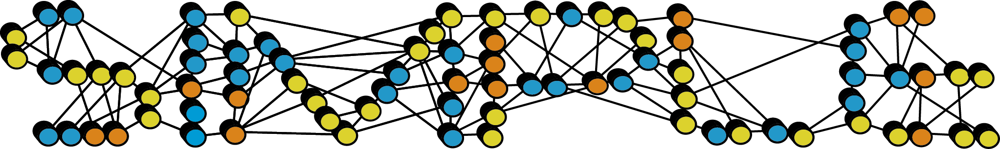
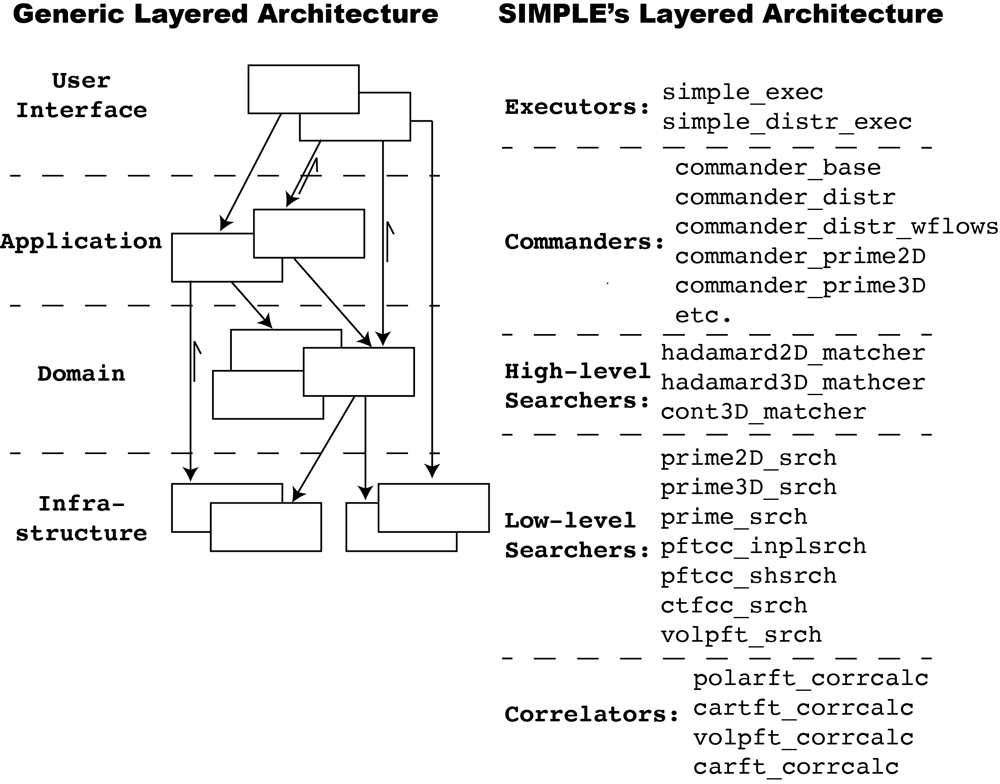

# SIMPLE Git Repo Onboarding

Developer orientation: map, docs, wiki, and build environment

May 21, 2026

{width=72%}

# What SIMPLE Is

- High-performance cryo-EM image processing and reconstruction platform.
- Turns movies, micrographs, and particle images into 2D class averages, 3D reconstructions, symmetry analysis, and structural models.
- Supports batch workflows, streaming pipelines, single workstations, and distributed HPC environments.

# First Pass Through the Repo

- `README.md`: project purpose, installation flow, release links, and update notes.
- `src/`: Fortran library and domain implementation.
- `production/`: executables plus executable tests.
- `scripts/`: generated runtime helpers, install helpers, and utility scripts.
- `nice/`: NICE Django GUI, classic batch GUI, stream GUI, and local launcher support.
- `doc/`: developer guides, policies, code map, how-tos, tutorials, release notes.
- `build/`: generated local build artifacts; useful for inspection, not source.

# Mental Model

- Infrastructure and platform services sit at the base: definitions, I/O, external libraries, system wrappers.
- Domain objects and numerical engines live in the middle: images, volumes, orientations, projects, CTF, motion, search, reconstruction, filtering.
- Commanders orchestrate workflows: they parse typed parameters, assemble context, dispatch strategies, and update project state.
- Executables are thin entry points around SIMPLE, SINGLE, stream, private, and test workflows.
- GUI code is a launcher, monitor, and project browser around the Fortran executables.

# Architecture at a Glance

{height=82%}

# Codebase Map Is Your Index

- Start with `doc/code_overview/code_base_map.md`.
- Use it to find module ownership before searching manually.
- It names major directories, executable entry points, commanders, strategies, tests, GUI utilities, and queue-system utilities.
- Treat its vocabulary as the shared map: `builder`, `parameters`, `commander`, `strategy`, `sp_project`, `image`, `volume`, `ori`, `oris`.

# Developer Docs in `/doc`: Start Here

| Folder | What New Developers Get |
| --- | --- |
| `code_overview/` | Code base map in Markdown and Word formats. |
| `for_developers/` | Developer guide, architecture/design guide, performance refactoring guide, GUI onboarding, probability/projection notes, templates, diagrams, logos. |
| `policies/` | Scientific and architectural policies: `refine3D`, `abinitio2D`, nonuniform filtering, automasking, interpolation, persistent workers, sigma, picking, fractional updates. |
| `how2s/` | Short recipes for git, gdb, Fortran debugging, FFTW installation, and SLURM arrays. |

# More `/doc` Resources

| Folder | What To Use It For |
| --- | --- |
| `algorithms/` | Focused algorithm notes such as motion correction and NU filter/Potts prior material. |
| `microchunk_and_rejection/` | Microchunk/rejection model integration, model class-average rejection, and policy docs. |
| `refactoring_notes/` | Design records for CMake, global-state removal, PFTC ranges, image/string/exec notes, and probability-neighborhood refactors. |
| `simple_tutorials/` | Tutorial source and workflow figures for examples and user-facing walkthroughs. |
| `release_notes/` | Historical release notes. |
| `README_old.txt` | Legacy installation/reference material; useful when comparing older instructions. |

# Build & Compilation Environment

- Current checkout is CMake-first: root `CMakeLists.txt` is the entry point and exports `compile_commands.json`.
- This checkout requires CMake 3.25+ and GCC/GFortran 14+ in the active CMake path.
- Required dependencies include FFTW3, TIFF/JPEG/ZLIB, libcurl; NICE work also needs the Python/Django web stack.
- Defaults: `USE_OPENMP=ON`, `BUILD_TESTS=ON`, `NICE=OFF`, local install prefix under `build/`.
- Optional paths: `NICE=ON`, `USE_OPENMP_OFFLOAD=ON`, `USE_OPENACC`, `USE_COARRAYS`, `USE_MPI`.

```bash
mkdir build
cd build
cmake ..
cmake --build . --parallel
cmake --install .
```

# Build Scripts You Will See

- `compile_clean.sh`: clean release-style build.
- `compile_debug.sh`: debug build.
- `compile_gpu.sh`: OpenMP offload build.
- `compile_gui.sh`: NICE-enabled build.
- `compile_conda.sh`: conda-provisioned GCC/GFortran, FFTW, TIFF, JPEG, Python, and CMake environment.
- `compile_csbclust.sh`: module-based HPC build.
- After install: source `build/add2.bashrc`, or add `build/bin`, `build/scripts`, and `SIMPLE_PATH` manually.

# Wiki, CI, and Team Workflow

- Repo: <https://github.com/hael/SIMPLE>
- Wiki: <https://github.com/hael/SIMPLE/wiki>
- CI: GitHub Actions build/test workflow is linked from `README.md`.
- Use local `/doc` for implementation-level guidance; use the wiki for project-level orientation.
- Before changing scientific behavior, read the nearest policy or refactoring note.
- For new command-line parameters, add typed support through `src/main/simple_parameters.f90` and downstream `params%...` usage.
- Add or run the closest executable tests under `production/tests`.

# Suggested First-Day Path

1. Build once with manual CMake or the closest helper script.
2. Read `README.md`, `doc/code_overview/code_base_map.md`, and the relevant developer guide.
3. Trace one command from `src/main/ui` to commander, strategy/domain code, and project output.
4. Keep `doc/policies/` open when touching scientific behavior.
5. Use `doc/how2s/` for day-to-day mechanics: git, gdb, Fortran debugging, FFTW, SLURM.
