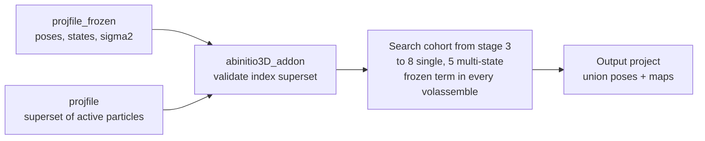

# abinitio3D_addon — development proposal

Date: 2026-09-25 (first draft 2026-09-24). Drafted against master `0bf593876`.
Nothing implemented yet.

## 1. Context and goal

abinitio3D has no way to take a converged solution and let a larger set of
particles grow it without re-searching the particles that built it. This
proposal adds `abinitio3D_addon`: given a frozen project (the accepted
solution) and a current project whose active particles are a superset of the
frozen ones, the particles not covered by the frozen solution are searched
against it while the frozen particles contribute their signal, unsearched, to
every reconstruction. The motivating case is a solution obtained on a harsh
class-average selection that the user wants to extend with the particles an
earlier, more permissive selection contained, to see what they add.

The workflow is defined by two projects, `projfile` and `projfile_frozen`, and
nothing else: the frozen project supplies poses, state labels, halves and its
own sigma2 state; the current project supplies the particles and their 2D
metadata; the two share one particle index space.

What exists today. The abinitio3D entry routes are a random start,
`cavg_ini`, `cavg_ini_ext`, `vol1` and state continuation (`state=`); none
takes a second project as a trusted, particle-backed solution, and `vol1`
treats its maps as untrusted and re-initialises poses by CC. `refine3D` with
`update_missing=yes` assigns particles with `updatecnt==0` in a single greedy
pass and is refused in probabilistic modes (`simple_strategy3D_matcher.f90`:
"update_missing requires matcher-owned assignment").

The gap: once a solution exists, particles outside it have no 3D pose, and the
only tools on hand either re-run everything or assign newcomers in a single
greedy pass against a fixed map. Neither lets the newcomers add signal to the
model while being searched properly.

## 2. Strategy in one page

In the first implementation the frozen project's particles are not searched;
the current project's other active particles are run through a standard
abinitio3D from the probabilistic stage on, with the frozen particles' Fourier
accumulators summed into every reconstruction as a second, constant set of
partials. The output is one
project carrying both cohorts' poses and the union maps. Updating the solution
with searches over all active particles is a later extension (section 6).



The output is an ordinary project: it can be inspected, refined with
`refine3D`, or itself become the frozen project of a later add-on.

The design reuses one existing object on both backends: the raw accumulator at
full dataset mass, which is what the trailing chain already is. Gridding trails
`trailrec_stateNN_{even,odd}` sums plus `rho` in `blend_trailing_accumulators`
(`simple_commanders_rec_distr.f90`), and PCG trails raw `(B,D)` pairs through
`add_raw_accum_weighted` in the distributed master
(`simple_rec3D_pcg_strategy.f90`); both readers already zero-extend a smaller
previous grid when the crop grows. A frozen contribution is the same artifact,
summed in like the partials of another partition: no coefficient, no decay,
never written into the chain. The reuse is the artifact and the reduction
step, not the trailing algebra (section 3, "How this differs from trailing").

| Piece | Owner today | Change |
| --- | --- | --- |
| Frozen accumulator set, once at the native box, cropped per distinct stage box | `calc_rec` + `reconstruct3D` (`trail_seed=yes` writes a full-mass chain seed) | Sibling handshake writes a `frozen_*` set instead of the chain, run on the frozen project file itself |
| Summing it into the reduction | `restore_state_from_parts`, PCG master reduction | One new step after the trailing blend, before restoration or priors |
| Which particles are frozen | nothing | Commander validates that the frozen project's active indices are active in the current project, masks them to `state=0` in its working copy, restores them with the frozen poses at the end |
| The workflow | `abinitio3D`, `abinitio3D_cavgs` (own UI entry, exec case, commander, shared `simple_abinitio_utils` helpers) | New `abinitio3D_addon` program with the same three pieces; `nstates`, `pgrp` and the state volumes are read from the frozen project, never from the command line |
| No sampling | `force_full_sampling_mode` (nsample/active > 0.9) | Forced on in the add-on commander |

## 3. Frozen contributions

A frozen contribution is a per-state, per-half raw accumulator set built once
from the frozen particles at the native box, cropped to each distinct stage
box, and summed into the add-on run's current partials, as a second set of
partials, before any restoration or prior.

```text
gridding:  S_eo  = S_eo(cohort)  + S_eo(frozen)      Fourier sums
           rho_eo = rho_eo(cohort) + rho_eo(frozen)  sampling density
pcg:       B = B(cohort) + B(frozen)                 weighted RHS
           D = D(cohort) + D(frozen)                 Gram precursor, before end_accum
```

This is a plain union of two particle sets, not a fractional update: no `u/f`
scaling, no `1-u` decay. Sampling density and FSC then describe frozen plus
cohort, which is the model the cohort particles are being aligned to.

**How this differs from trailing.** Trailing has one population, all of it
searchable: each iteration a random fraction `f` is re-searched and yields
partials of mass `f*D`, and the chain is an exponential moving average,
`chain_t = (u/f)*current_t + (1-u)*chain_{t-1}`. The `u/f` makes a
fractional-mass partial stand in for the whole population; the `1-u` decay
makes stale poses fade at `(1-u)^k` until the particle is resampled and its
new pose replaces the old one. "Frozen per iteration" there means only "not
resampled this iteration": every pose keeps moving, the chain always holds
some contribution from poses `k` iterations old, total mass stays `D` by
convex mixing, and the chain is rewritten every iteration. Here there are two
populations. `F` has fixed poses for the whole run and is never searched; `C`
is searched in full every iteration. The reconstruction at iteration `t` is
`A_F + A_C(t)`: `A_F` is an actual full-mass reconstruction of `F`, computed
once and read-only; `A_C(t)` is the ordinary complete set of partials of `C`.
Nothing stands in for anything, so there is no `u/f`; nothing goes stale, so
there is no `1-u`; the mass is `|F| + |C|` because it is a union, not a
mixture. The map at iteration `t` is exactly what a one-shot reconstruction of
`F` and `C` with `F`'s fixed poses and `C`'s current poses would give, with no
memory of `C`'s earlier poses. The frozen term must stay outside the chain: if
`A_F` were folded in, the `1-u` decay would erode it by `(1-u)^k` unless
re-added, and re-adding while it is inside double counts. Keeping it separate
also means that if the cohort is ever sampled in a later version, trailing
applies to `C` alone and `A_F` is still summed in, unchanged, after the blend.

**Producer.** `calc_rec` (`simple_abinitio_utils.f90`) already runs
`reconstruct3D` on a project and, with the internal `trail_seed=yes`
handshake, writes the accumulators at full mass. The add-on commander calls it
once on the *frozen* project at the native box (no `box_crop`) with a sibling
handshake (`frozen_seed=yes`) so the writer targets a different artifact
stem: `frozen_stateNN_{even,odd}` plus `rho` and a manifest on
gridding, and a `frozen` raw pair with `pcg_chain_provenance` on PCG. Names
must avoid the `recvol_state` and `trailrec` stems so partial-reconstruction
globs, chain validation and cleanup never touch them.

**Cropping.** The stage plan (`lpinfo(start_stage:nstages)%box_crop`) uses a
handful of distinct boxes; the commander derives one cropped set per distinct
box from the native set, plus the native set itself for `calc_final_rec`.
Under the constant field-of-view contract (`box*smpd == box_crop*smpd_crop`)
consecutive padded lattices share their frequency step, so the smaller grid is
an index-aligned central subset of the larger: the crop is a central clip of
the even/odd Fourier sums and `rho` on gridding, and of `B` and `D` on PCG,
followed by the same manifest and provenance write as the producer. The one
approximation is the native lattice's wrap rim: KB windows that wrapped around
the native period leave aliased mass in the outermost native shells, which sit
beyond every cropped stage's matching band. The PCG chain already accepts
exactly this approximation in the opposite direction (`add_raw_accum_weighted`
embeds a smaller chain by zero-extension), so it introduces nothing new. The
starting `vol1..volN` for `start_stage` are restored from the stage-3 cropped
set the same way `volassemble` restores partials.

**Consumer.** Gridding: a new `add_frozen_accumulators()` step in
`restore_state_from_parts`, after `blend_trailing_accumulators()` and before
`sum_eos_before_density_correction_if_needed()`, reading through
`read_gridding_pair_accumulators` and `sum_reduce`. PCG:
`add_raw_accum_weighted(frozen, weight=1.0)` in the distributed half job after
the chain write and before `end_accum`, so `B`/`D` see the union and priors are
applied to the union. In both cases the trailing chain, if active, is written
*before* the frozen term is added, so the chain carries only the cohort's mass.

**Why one accumulation.** Recomputing the frozen set at every stage would
cost one full-population reconstruction per stage for identical information; a
single native-box accumulation costs one, and each crop is a memory copy.
Padding is never used in this direction: the previous-artifact readers
zero-extend a smaller grid beyond its Nyquist, which would silently discard the
frozen particles' signal above the stage-3 Nyquist for the rest of the run, so
a cropped set must always come from the native set, never from an earlier
stage's set.

**Sigma2.** The frozen cohort's committed residual sigma2 is consumed exactly
once, by the native-box accumulation; it is never re-estimated, re-read or
re-scaled per stage. The canonical state lives at the native box
(`fdim(box)-1` shells) and every cropped stage box uses a prefix of those
shells under the constant field-of-view contract, so the sigma weighting is
already inside the cropped sums, `rho`, `B` and `D`; there is no per-stage
sigma work for frozen particles, just as there is no per-stage accumulation.
Canonical identity is validated against `params%nptcls` and a layout digest
over every row (`sigma2_state_project_layout_digest`,
`ensure_canonical_sigma_state` in `simple_rec3D_strategy.f90`), and a mismatch
rebuilds the state from particle power spectra; running the one accumulation
on the frozen project *file itself* keeps its state valid as is. The add-on
run estimates its own state for the cohort in the current project, where
frozen rows are `state=0` and carry unused bootstrap values.

At the end the commander composes the output project's state without any
estimation: cohort rows from the add-on's committed state, frozen rows copied
by index from the frozen project's state, through the transactional
candidate/range/commit machinery in `simple_sigma2_state.f90`
(`sigma2_state_merge_local_ranges` is the carrier). One numerical gate
accompanies this: the identity test (section 6) run once with
sigmas estimated jointly on `A u B` and once with the frozen rows from a run
on `A` alone and the cohort rows from the add-on, comparing maps and FSC. The
add-on residuals are taken against a reference that already contains the
frozen term, so agreement is expected but must be measured, not assumed. The
rule that a fresh abinitio3D drops an inherited `sigma2_state` registration
applies to the current project only.

**Provenance.** The frozen manifest records box, smpd, particle count, state
layout and a run identifier; readers discard the set and fail loudly on
mismatch, mirroring `validate_trail_chain` and the PCG chain identity. A
silent fallback to reconstruction without the frozen term must not exist.

**Symmetry.** The frozen run is already on the target axis; the add-on runs
with `pgrp_start=pgrp`, so the frozen accumulation and the cohort partials are
replicated identically.

## 4. The abinitio3D_addon workflow

Recommendation: `abinitio3D_addon` is its own program with its own UI entry,
exec case and commander, sharing the stage helpers of `simple_abinitio_utils`
with `abinitio3D` and `abinitio3D_cavgs` but not their entry logic. It takes
`projfile` and `projfile_frozen`, inherits everything that describes the
solution from the frozen project, validates that the current project is a
superset by particle index, and masks the frozen particles in its own working
copy, so refine3D needs no new sampling policy at all.

**Superset validation.** The two projects share one particle index space:
`projfile_frozen` was derived from `projfile`, or both from a common ancestor,
by selection, so row `i` is the same particle in both. The commander requires
equal `ptcl3D` row counts and an identical stack table (`os_stk` count and
stack references after path normalisation, so a relocated copy still passes),
then checks that every index with `state > 0` in the frozen project has
`state > 0` in the current project. A frozen active index that is inactive in
the current project, a row-count or stack-table mismatch, or a box or `smpd`
mismatch is a hard error naming the first offending index; the current project
is not modified. The cohort is then the current project's active indices that
are not frozen-active, plus the frozen-active rows with `updatecnt == 0`. The
commander reports the frozen, cohort and never-updated counts before the first
reconstruction.

**Option A, working-copy masking (recommended).** abinitio3D already copies
the project into its run directory (`mkdir=yes`). In that copy the commander
sets `state=0` in both `ptcl2D` and `ptcl3D` for every frozen row. abinitio3D
machinery then sees only the cohort everywhere it counts particles
(`count_state_gt_zero`, `reset_ptcl3D_from_ptcl2D_selection` derives the 3D
state from the 2D state, `gen_labelling` randomises only active ones). After
the final reconstruction the commander restores the frozen rows with the
frozen project's poses, state labels, `eo` and `updatecnt`, stamps them
`frozen=1`, and writes the output project: one project with every particle
posed, which the user then inspects, refines, or feeds into a later add-on as
its frozen project. The ptcl2D mask is required because the fresh-start route
resets `ptcl3D%state` from the 2D selection.

**Option B, cohort filter inside refine3D.** `sample4update_missing`
(`state>0 .and. updatecnt==0`) is the natural candidate, but it increments
`updatecnt` on the first pass and so selects nothing on the second iteration,
and the matcher refuses it under `prob_align`. Making it multi-iteration and
prob-compatible means a persistent cohort key consulted by `sample4update_*`,
`prob_align`/`prob_tab` reproduction and `sample4update_reprod`, plus the
trailing-fraction bookkeeping in `get_update_frac`. That touches the
importance-sampling contract in four modules for no gain over A. Keep B in
reserve for the case where the same project must serve both cohorts at once.

**Where `updatecnt` earns its keep: the freeze.** In the frozen project,
particles with `updatecnt > 0` were searched and are frozen; particles with
`updatecnt == 0` (never sampled when that run used `nsample` below the
full-sampling switch) are *not* frozen and join the cohort, together with the
particles only the current project activates. Under full sampling an add-on
output has no such particles, so a chain of add-ons freezes cleanly.

**Inputs and inheritance.** The command line is stripped to what the add-on
can legitimately vary. Everything that describes the solution is read from the
frozen project: `nstates` is the number of populated states in its `ptcl3D`
(cross-checked against the state volumes registered in its `out` segment),
`pgrp` is its point group, `multivol_mode` follows (`independent` for more
than one state, `single` otherwise), and the starting references are its state
volumes. Box and `smpd` are the current project's and must equal the frozen
project's. Of the 43 inputs `new_abinitio3D` registers today, the add-on UI
entry keeps 17; the rest are absent from the entry and refused by the
commander if they appear on the command line, the way state continuation
refuses `vol1` today.

| Group | Keys | Status in `abinitio3D_addon` |
| --- | --- | --- |
| Required | `projfile`, `projfile_frozen` (new), `mskdiam` | accepted |
| Compute | `nparts`, `nthr` | accepted |
| Stage range and low-pass | `nstages` (3 or more), `lpstart`, `lpstop`, `force_lp_range`, `hp` | accepted; planned from the current project's FRCs unless forced |
| Reconstruction and filtering | `rec_backend`, `maxits_pcg`, `maxits_ml`, `filt_mode`, `automsk`, `envfsc`, `envmsklp` | accepted, same stage policy as `abinitio3D` |
| Convergence and diagnostics | `overlap`, `addon_diag` (new) | accepted |
| Inherited from the frozen project | `nstates`, `pgrp`, `pgrp_start`, `multivol_mode`, `vol1` | refused if given |
| Entry routes of `abinitio3D` | `cavg_ini`, `cavg_ini_ext`, `state`, `lpstart_ini3D`, `lpstop_ini3D`, `nthr_ini3D`, `split_stage` | refused: the add-on has one entry route and no ini3D or docked phase |
| Sampling | `nsample` | refused: the add-on always runs full sampling |
| Random-start reference handling | `center`, `cenlp` | refused: the frozen references are already centred and on axis |
| Search internals and diagnostics | `objfun_den`, `objfun_den_w`, `inpl_cont`, `ptcl_src`, `lp`, `conical_fsc`, `projrec`, `euclid_diag` | absent in the first cut; add back one at a time if a use appears |
| Final-stage PCG priors | `pcg_solvent`, `pcg_solvent_lambda`, `pcg_solvent_check` | absent in the first cut; stage-8-only today, so relevant only to single-state runs that reach stage 8 |

**Registration.** `new_abinitio3D_addon` in
`src/main/ui/simple/simple_ui_abinitio3D.f90`, a `case('abinitio3D_addon')`
in `src/main/exec/simple_exec_abinitio3D.f90`, and
`commander_abinitio3D_addon` with `exec_abinitio3D_addon` in a new
`simple_commanders_abinitio_addon.f90` beside the existing abinitio
commanders. `exec_abinitio3D` is not touched: the add-on commander has a
straight-line flow of its own (validate, inherit, mask, stage loop, final
reconstruction, restore, write) and calls the shared helpers
`set_cline_refine3D`, `calc_rec`, `exec_refine3D` and `calc_final_rec`, the
same way `abinitio3D_cavgs` does.

**Flow.**

- `pgrp_start = pgrp`; the symmetry axis was settled by the frozen run, so no
  axis search and no `symmetrize` call.
- `start_stage = PROB_REFINE_STAGE` (3): cohort particles get `rnd_oris`,
  uniform random state labels in `independent` mode, and their first
  assignment comes from the stage-3 `refine=prob` search at the planned
  stage-3 low-pass. Compare the `vol1` route of `abinitio3D`, which enters at
  stage 4 after a CC pose-initialisation pass because its references are
  untrusted; here they are trusted, so that pass is skipped. Open question:
  enter at 3 (lower LP, safer for random starts) or 4 (one stage less).
- The last stage follows the inherited state count exactly as in
  `abinitio3D`: a single state runs stages 3 to 8 (`NSTAGES`, `prob` then
  `prob_neigh`, NU filtering from stage 6); `independent` multi-state stops
  after stage 5 with `lpstop` 6 A (`NSTAGES_INDEPENDENT`,
  `LPSTOP_INDEPENDENT`). `nstages` and `lpstop` on the command line lower
  these as today.
- Starting references and the first frozen set come from one `calc_rec` on the
  frozen project at `start_stage`.
- Stage schedule, `nspace`, `ml_reg`, `frac_best`, early stopping and backend
  policy stay exactly as `build_refine3D_stage_cfg` emits them for stages 3 to
  `nstages`; the controller gains no add-on branch beyond a flag that switches
  the FSC=0.5 stage-LP promotion (`FSC05_PROMOTE_MIN_STAGE`) off, because the
  FSC reflects the frozen population and would promote the cohort past its
  planned ladder.
- Low-pass planning uses the current project's FRCs as today, overridable with
  `lpstart`/`lpstop` and `force_lp_range`.
- Optional diagnostic, `addon_diag=yes`: a cohort-only reconstruction at the
  native box after the run, without the frozen term, so the newcomers' own map
  and FSC can be compared with the frozen project's maps and the union.

**No sampling.** The commander sets `nsample` to the cohort size so
`force_full_sampling_mode` engages: `update_frac`, `fillin` and `trail_rec`
are suppressed and every iteration updates the whole cohort. Compute is
governed by the cohort size alone, which the caller controls through the
selection that defines `projfile`.

**Multi-state.** State indices are the frozen run's. Cohort particles start
with random labels and the `prob` search of stages 3 to 5 assigns states;
`ensure_multistate_particle_assignments` runs as today before the final
reconstruction. Single-state runs continue through `prob_neigh` and the NU
stages 6 to 8. In both cases `calc_final_rec` consumes the native-box frozen
set so the shipped state volumes are the union.

## 5. Architectural considerations

Every change lands in the subsystem that already owns the concern;
`abinitio3D` and `abinitio3D_cavgs` are not entered by the new program, only
their shared helpers are.

| Subsystem | Change | Untouched |
| --- | --- | --- |
| `src/main/ui/simple/simple_ui_abinitio3D.f90`, `src/main/exec/simple_exec_abinitio3D.f90` | `new_abinitio3D_addon` program entry (17 inputs, no `nstates`/`pgrp`/`vol1`); `case('abinitio3D_addon')` | `abinitio3D`, `abinitio3D_cavgs` entries |
| `src/main/commanders/simple/simple_commanders_abinitio_addon.f90` (new) | `commander_abinitio3D_addon`: inheritance from the frozen project, refusal of the stripped keys, superset validation by index, working-copy masking, stage loop 3 to `nstages` through the shared helpers, one native-box frozen `calc_rec` and per-box crops, frozen-row restore, `frozen` flag and sigma2 union in the output project | `simple_commanders_abinitio.f90` and `exec_abinitio3D` entirely |
| `src/main/abinitio/simple_abinitio_controller.f90` | One flag: FSC=0.5 promotion off; full sampling forced through the existing switch | `NSTAGES`, `NSPACE`, `MAXITS`, mode/backend/trailrec policies |
| `src/main/abinitio/simple_abinitio_utils.f90` (`calc_rec`) | `frozen_seed` handshake beside `trail_seed`; frozen artifact stem | Stage-boundary reconstruction semantics |
| `src/main/commanders/simple/simple_commanders_rec_distr.f90` | `add_frozen_accumulators()` in `restore_state_from_parts`; provenance check | Trailing blend, restoration, FSC, NU inputs |
| `src/main/strategies/parallelization/simple_rec3D_pcg_strategy.f90` | Frozen raw pair summed into the reduction in the distributed half job | Solver, priors, support, chain identity |
| `src/main/sigma2/simple_sigma2_state.f90` | Row import by index from a second project's committed state (frozen rows into the output state) | Transaction, validation and commit semantics |
| `src/main/project` | Superset validation helper: row counts, stack table, active-index inclusion between two projects | Segment layout |
| `src/defs/simple_refine3D_fnames.f90` | `frozen_*` artifact names | Existing stems and globs |
| `src/main/params` | `projfile_frozen`, `frozen_rec`, `addon_diag`, `fsc05_promote` | Everything else |

Rules this design keeps (from `simple-frac-update-trailing`, `simple-refine3d`,
`simple-architecture`):

- Producer writes what the consumer expects: the frozen set is produced at the
  consuming stage's crop by the same `reconstruct3D` that produces the chain
  seed, and the reader validates provenance rather than accepting a mismatch.
- Accumulators, not volumes, are the source of truth. Blending frozen and
  cohort *maps* would double-regularise and break the sampling-density
  weighting; the sum happens on raw sums and `rho` (or `B` and `D`) before any
  restoration or prior.
- The matcher's single-read particle I/O and partial-reconstruction handoff are
  untouched; the add-on run's partials are ordinary partials of a smaller
  active set.
- `volassemble` stays the execution site for volume-domain work; the frozen
  add is one more step there, not a new commander.
- `ui -> exec -> commander -> strategy/domain` is preserved: the program has
  its own UI entry and exec case, new keys are registered in `parameters`
  before any command line carries them, and the commander consumes typed
  fields after `params%new`.
- Existing workflows keep their contracts: `abinitio3D` and `abinitio3D_cavgs`
  gain nothing but a controller flag they never set.

Deliberate non-goals for the first cut: no cohort filter inside refine3D, no
frozen term in the trailing chain, no re-search of frozen particles (see
section 6 for the later all-particle update), no orchestration of repeated add-ons; a
caller that wants a chain of add-ons runs the program again with the output as
the frozen project.

Tests:

- Identity gate, both backends: reconstruct `A u B` in one go versus
  frozen(`A`) plus partials(`B`) at the same crop; `1e-6` relative on
  sums/`rho` and on `B`/`D`, in the spirit of `trailing_reconstruction_blend`
  and `test=pcg_frac_update`.
- Crop gate: the central clip of the native set equals a set accumulated
  directly at that crop to 1e-6 inside the stage's matching band on both
  backends, and the rim difference beyond the band is reported; a set at a
  smaller box than the consumer's is rejected by provenance, never padded.
- Superset gate: a frozen project with one active index inactive in the
  current project, a row-count mismatch, and a relocated stack path each
  produce the expected outcome (two errors naming the index, one pass).
- Isolation gate: `abinitio3D` and `abinitio3D_cavgs` produce byte-identical
  command lines before and after the change (controller output diff), since
  the new program only adds a flag to the controller and shares helpers.
- End to end on a real data set: solution on a strict class-average
  selection, add-on with the permissive selection, union FSC and cohort-only
  map compared with a one-shot run on the permissive selection.

Compilation and runs stay with the user, per the repository policy.

## 6. Full-particle update passes

A full-particle pass re-opens every pose against the union model. It is not
part of `abinitio3D_addon`: the add-on's output is an ordinary project with
every particle posed, so the pass is a subsequent refinement of that project,
and when it is run is the caller's policy.

**Why it is needed.** Frozen poses were found against a smaller-population,
lower-resolution model, and each add-on cohort is only ever refined against
the model it joined. Without an occasional pass the solution ratchets:
newcomers improve the map, but the particles that built it never benefit, and
in multi-state runs the state partition never changes.

**What it is.** All particles active, standard `update_frac`/`nsample`
sampling and `trail_rec`, seeded from a full reconstruction through
`trail_seed`. Two candidate carriers: `refine3D` with the inherited `nstates`
(`refine=prob` then `prob_neigh`, the emitted controls of stages 5 and later),
or the abinitio3D state-continuation route (`state=`), which today requires
`multivol_mode=single` and would need an `independent` extension. The first
reuses more and keeps the states coupled; the second gives the NU ladder for
free. Decide once the add-on exists and its outputs can be inspected.

**Interaction with add-ons.** After a pass the refined project can be the
frozen project of a later add-on; frozen accumulator sets are never reused
across runs, each add-on regenerates them at its own stage crops.

## 7. Risks, open questions and plan

The numerics are a straight sum of artifacts that already exist; the risk sits
in the policy edges around them.

Risks:

- Frozen mass dominates the FSC, so any FSC-driven control (stage-LP
  promotion, NU band selection, early stopping on resolution) sees the frozen
  model, not the cohort. Promotion is switched off; multi-state runs never
  reach the NU ladder, single-state runs do from stage 6 (open question
  below), and `overlap`-based early stopping is computed on
  the cohort only.
- A junk-rich cohort barely moves the map but is posed and written into the
  output all the same. The run reports per-state populations and the union
  resolution against the frozen project's, and `addon_diag` shows the cohort
  on its own; rejecting the outcome is the user's call.
- The frozen partition never changes inside an add-on; a chain of add-ons
  without a refinement pass keeps the first solution's states forever.
- Sigma2: the cohort's sigma2 is estimated on its own population; the
  joint-versus-separate gate measures the effect before it is trusted.
- Disk: one frozen set per distinct stage box per state, four files each,
  plus the native set; a handful of sets in total.
- A cohort too small for a stable multi-state split; enforce a floor on the
  cohort size per populated state and refuse below it.

Open questions:

- [ ] Enter at stage 3 (planned lower LP, safer for random starts) or stage 4
      (one stage less, as the `vol1` route)?
- [ ] Frozen-project rows with `updatecnt == 0`: join the cohort (proposed) or
      stay excluded?
- [ ] Single-state runs reach the NU stages 6 to 8 by default: does the
      frozen term feed the NU-filter inputs there, or only the base pair?
- [ ] Full-pass carrier: multi-state `refine3D` or an `independent` extension
      of the state-continuation route?
- [ ] Cohort-size floor per state: absolute count or a fraction of the frozen
      population?

Phased plan:

| Phase | Scope | Gate |
| --- | --- | --- |
| 1 | Frozen accumulator contract: `frozen_seed` writer in `calc_rec`/`reconstruct3D`, central crop of a set to a smaller constant-FOV box, `frozen_*` names, summation into the reduction in gridding `restore_state_from_parts` and the PCG master, provenance validation; sigma2 row import by index | Identity and crop unit gates on both backends; joint-versus-separate sigma gate |
| 2 | `abinitio3D_addon` program: UI entry, exec case, commander with inheritance from the frozen project and refusal of the stripped keys, superset validation, masking, stage-3 entry, forced full sampling, promotion off, one native-box frozen accumulation cropped per distinct stage box, frozen-row restore and output project, `addon_diag` | Superset and isolation gates; strict-versus-permissive selection scenario on a real data set |
| 3 | Full-particle pass: carrier decision and, if chosen, the `independent` extension of state continuation | Union FSC within tolerance of a one-shot run |

Phase 1 can be developed and tested with two hand-made projects before any
commander work starts, which keeps the numerics reviewable on their own.

## 8. Revision log

- 2026-09-24: first draft as a streaming feature; review findings folded in
  (explicit cohort set, sigma2 identity covers `nptcls` and row layout, accept
  channel direction, generation recovery).
- 2026-09-24, later: reframed as a batch abinitio3D capability (Hans: not
  streaming-specific; the harsh-selection case). The commander owns cohort
  determination, masking, the frozen-row restore and the sigma2 union; the
  frozen reconstruction runs on the frozen project file itself, which removes
  the need for a sigma2 state extension.
- 2026-09-25: `abinitio3D_addon` is its own program (UI entry, exec case,
  commander) rather than a route inside `exec_abinitio3D`; `nstates`, `pgrp`,
  `multivol_mode` and the starting references are inherited from the frozen
  project and refused on the command line; the CLI is stripped to 17 of
  abinitio3D's 43 inputs (Hans).
- 2026-09-25, later: streaming removed from the note entirely (Hans); the
  workflow is defined by `projfile` and `projfile_frozen` alone, and the
  superset relation is validated on active particle indices rather than
  matched by stack identity. Streaming orchestration, if wanted, is a separate
  note that calls this program.
- 2026-09-25, later still: the frozen set is accumulated once at the native
  box and central-cropped to each distinct stage box, not recomputed per
  stage; the frozen sigmas are likewise consumed once, by that accumulation,
  and copied by index into the output state (Hans).
