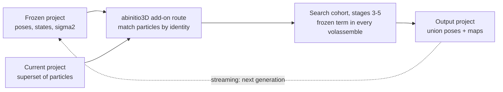
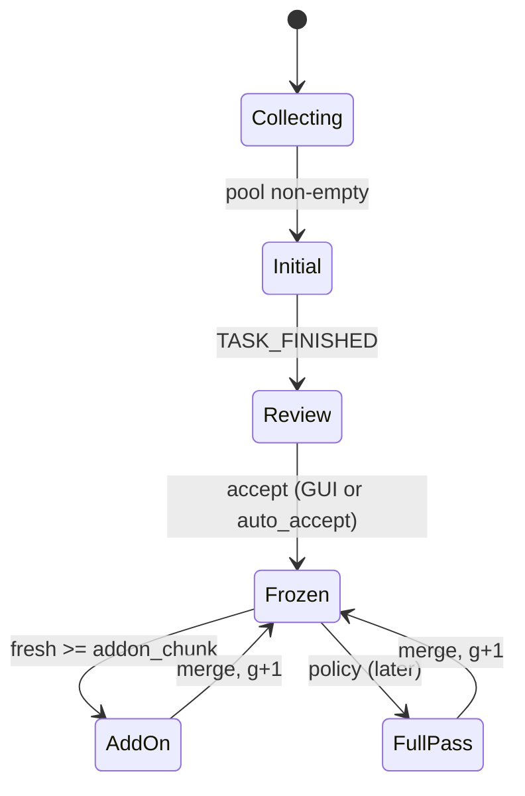

# abinitio3D add-on mode — development proposal

Date: 2026-09-24. Drafted against master `0bf593876`. Nothing implemented yet.
Living copy with diagrams: https://claude.ai/code/artifact/34c868cf-1901-44f1-9c01-e490e5ae51b2

## 1. Context and goal

abinitio3D has no way to take a converged solution and let a larger set of
particles grow it without re-searching the particles that built it. This
proposal adds an *add-on* mode to batch abinitio3D: given a frozen project (the
accepted solution) and a current project (a superset of its particles), the
particles not covered by the frozen solution are searched against it while the
frozen particles contribute their signal, unsearched, to every reconstruction.
Streaming is one consumer of that mode; the other is an ordinary project
workflow, for instance a solution obtained on a harsh class-average selection
that the user wants to extend with the particles an earlier, more permissive
selection contained, to see what they add.

The mode is defined by two projects, not by a pipeline: the frozen project
supplies poses, state labels, halves and its own sigma2 state; the current
project supplies the particles and their 2D metadata; the commander works out
which particles are which by identity.

What exists today. In batch abinitio3D the entry routes are a random start,
`cavg_ini`, `cavg_ini_ext`, `vol1` and state continuation (`state=`); none
takes a second project as a trusted, particle-backed solution, and `vol1`
treats its maps as untrusted and re-initialises poses by CC. In streaming
(`src/main/stream/simple_stream_p07_abinitio3D_multistate.f90`):

- Exported sets are quality-selected on import (`model_cavgs_rejection`,
  `quality_mode=apply`, `rejection_type=pool`) and appended contiguously to the
  pool project (`import_sets_into_pool`).
- On the first non-empty pool, ingestion is paused and one `abinitio3D` is
  launched asynchronously (`start_abinitio3D`: `nstates=3`, `pgrp=c1`,
  `force_lp_range=yes` with 50 to 10 A, `nstages=NSTAGES3D`); completion is
  polled through `TASK_FINISHED` and the pool project is replaced by the run's
  project (`finish_abinitio3D`).
- **Prerequisite:** at `0bf593876` the launcher sets `NSTAGES3D = 1` (the
  `!5` beside it is a comment), a testing stub. The initial run therefore
  executes stage 1 only and does not produce the stage-3-to-5 solution this
  design freezes. Restoring `NSTAGES3D = 5`, or dropping the explicit
  `nstages` so the independent default applies, is phase 0 of the plan.
- With that restored, independent multi-state runs stop after stage 5
  (`NSTAGES_INDEPENDENT = PROB_NEIGH_REFINE_STAGE - 1`), so a three-state run
  ends with the `refine=prob` stages 3 to 5 and a final all-particle
  reconstruction.
- A refine step is stubbed but disabled: `start_refine3D` builds a
  one-iteration `refine=greedy` run with `update_missing=yes`, which only
  assigns particles with `updatecnt==0` and is refused in probabilistic modes
  (`simple_strategy3D_matcher.f90`: "update_missing requires matcher-owned
  assignment").

The gap: once the user accepts a solution, every particle that arrives
afterwards has no 3D pose, and the only tools on hand either re-run everything
or assign newcomers in a single greedy pass against a fixed map. Neither lets
the newcomers add signal to the model while being searched properly.

## 2. Strategy in one page

The frozen project's particles are never searched again; the current
project's other active particles are run through a standard abinitio3D from
the probabilistic stage on, with the frozen particles' Fourier accumulators
added at full weight to every reconstruction. The output is one project
carrying both cohorts' poses and the union maps. Streaming repeats this per
generation.



In batch use the loop runs once; in streaming the output project becomes the
next generation's frozen project and the growing pool the next current
project. A full-particle pass (section 7) is the later addition that re-opens
every pose.

The design reuses one existing object on both backends: the raw accumulator at
full dataset mass, which is what the trailing chain already is. Gridding trails
`trailrec_stateNN_{even,odd}` sums plus `rho` in `blend_trailing_accumulators`
(`simple_commanders_rec_distr.f90`), and PCG trails raw `(B,D)` pairs through
`add_raw_accum_weighted` in the distributed master
(`simple_rec3D_pcg_strategy.f90`); both readers already zero-extend a smaller
previous grid when the crop grows. A frozen contribution is the same artifact
with weight 1, no decay, and never written into the chain.

| Piece | Owner today | Change |
| --- | --- | --- |
| Frozen accumulator set per stage crop | `calc_rec` + `reconstruct3D` (`trail_seed=yes` writes a full-mass chain seed) | Sibling handshake writes a `frozen_*` set instead of the chain, run on the frozen project file itself |
| Adding it at weight 1 | `restore_state_from_parts`, PCG master reduction | One new step after the trailing blend, before restoration or priors |
| Which particles are frozen | nothing | Commander matches current to frozen rows by stack reference + `indstk`, masks matches to `state=0` in its working copy, restores them with the frozen poses at the end |
| Stage-3 entry with trusted references | `exec_abinitio3D` entry routes (`state=`, `cavg_ini_ext`, `vol1`) | New `l_addon` route: `frozen_projfile=` given, `pgrp_start=pgrp`, no CC pose init |
| No sampling | `force_full_sampling_mode` (nsample/active > 0.9) | Forced on in add-on mode |
| Generations, trigger, accept gate, recovery | stream p07 state machine | Thin consumer: passes the last output project as frozen and the pool as current |

## 3. Frozen contributions

A frozen contribution is a per-state, per-half raw accumulator set built from
the frozen particles at the consuming stage's crop, and summed at weight 1 into
the add-on run's current partials before any restoration or prior.

```text
gridding:  S_eo  = S_eo(fresh)  + S_eo(frozen)      Fourier sums
           rho_eo = rho_eo(fresh) + rho_eo(frozen)  sampling density
pcg:       B = B(fresh) + B(frozen)                 weighted RHS
           D = D(fresh) + D(frozen)                 Gram precursor, before end_accum
```

This is a plain union of two particle sets, not a fractional update: no `u/f`
scaling, no `1-u` decay. Sampling density and FSC then describe frozen plus
fresh, which is the model the fresh particles are being aligned to.

**Producer.** `calc_rec` (`simple_abinitio_utils.f90`) already runs
`reconstruct3D` at `abinitio_stage_box_crop(params, istage)` on a project and,
with the internal `trail_seed=yes` handshake, writes the accumulators at full
mass. The add-on route calls the same routine on the *frozen* project with a
sibling handshake (`frozen_seed=yes`) so the writer targets a different
artifact stem: `frozen_stateNN_{even,odd}` plus `rho` and a manifest on
gridding, and a `frozen` raw pair with `pcg_chain_provenance` on PCG. Names
must avoid the `recvol_state` and `trailrec` stems so partial-reconstruction
globs, chain validation and cleanup never touch them.

**When.** Once at entry to each planned stage (3, 4, 5 today), and once at the
native box before `calc_final_rec`. The stage-entry reconstruction at
`start_stage` also yields the starting `vol1..vol3`, exactly as the ini3D
routes get theirs.

**Consumer.** Gridding: a new `add_frozen_accumulators()` step in
`restore_state_from_parts`, after `blend_trailing_accumulators()` and before
`sum_eos_before_density_correction_if_needed()`, reading through
`read_gridding_pair_accumulators` and `sum_reduce`. PCG:
`add_raw_accum_weighted(frozen, weight=1.0)` in the distributed half job after
the chain write and before `end_accum`, so `B`/`D` see the union and priors are
applied to the union. In both cases the trailing chain, if active, is written
*before* the frozen term is added, so the chain carries only the add-on
cohort's mass.

**Why recompute per stage instead of cropping.** The previous-artifact readers
pad a smaller grid with zeros beyond its Nyquist; that is acceptable for a
decaying chain but would silently discard the frozen particles' signal above
the stage-3 Nyquist for the rest of the run. Recomputing at each crop reuses
the existing producer verbatim and costs one no-search reconstruction of the
frozen population per stage, cheap at cropped boxes. A later optimisation is
one native-box accumulation central-cropped per stage (the PCG policy already
relies on constant-FOV index alignment for chain growth), gated against the
per-stage result.

**Sigma2.** The frozen accumulation must use the frozen cohort's committed
residual sigma2. Canonical sigma2 identity is validated against
`params%nptcls` and a layout digest over every row (projname lineage, stack
references, `stkind`, `indstk`; `sigma2_state_project_layout_digest`,
`ensure_canonical_sigma_state` in `simple_rec3D_strategy.f90`), and a mismatch
rebuilds the state from particle power spectra. The frozen reconstruction
therefore runs on the frozen project *file itself*, never on a masked copy of
the current project: its row count and layout are unchanged, so its committed
state validates as is. The add-on run estimates its own state for the cohort
in the current project, where frozen rows are `state=0` and carry unused
bootstrap values.

At the end the commander composes the output project's state: cohort rows from
the add-on's committed state, frozen rows imported from the frozen project's
state by particle identity, through the transactional candidate/range/commit
machinery in `simple_sigma2_state.f90` (`sigma2_state_merge_local_ranges` is
the carrier). A numerical gate accompanies this: the identity test (section 6)
run once with sigmas estimated jointly on `A u B` and once with the frozen
rows from a run on `A` alone and the cohort rows from the add-on, comparing
maps and FSC. The add-on residuals are taken against a reference that already
contains the frozen term, so agreement is expected but must be measured, not
assumed. The rule that a fresh abinitio3D drops an inherited `sigma2_state`
registration applies to the current project only.

**Provenance.** The frozen manifest records box, smpd, particle count, state
layout and generation; readers discard the set and fail loudly on mismatch,
mirroring `validate_trail_chain` and the PCG chain identity. A silent fallback
to reconstruction without the frozen term must not exist.

**Symmetry.** The frozen run is already on the target axis; the add-on runs
with `pgrp_start=pgrp`, so the frozen accumulation and the fresh partials are
replicated identically.

## 4. The add-on route in batch abinitio3D

Recommendation: the commander determines the cohort by particle identity and
masks the frozen particles in its own working copy, so refine3D needs no new
sampling policy at all; `updatecnt` in the frozen project decides who is
frozen, not anything inside the run.

**Cohort determination.** A particle is identified by its stack reference and
`indstk`, the same pair the sigma2 layout digest uses. The commander reads the
frozen project's `ptcl3D`, matches each of its rows with `updatecnt > 0` to a
row of the current project, and refuses to run if any frozen particle has no
counterpart or if box, `smpd`, `pgrp` or the number of populated states
disagree. It reports the counts: frozen, cohort, and particles the frozen
project contained but never updated. Stack paths are compared after the same
normalisation the relocation tooling applies, so a relocated copy of the data
still matches.

**Option A, working-copy masking (recommended).** abinitio3D already copies
the project into its run directory (`mkdir=yes`). In that copy the commander
sets `state=0` in both `ptcl2D` and `ptcl3D` for every matched frozen row.
abinitio3D then sees only the cohort everywhere it counts particles
(`count_state_gt_zero`, `reset_ptcl3D_from_ptcl2D_selection` derives the 3D
state from the 2D state, `gen_labelling` randomises only active ones). After
the final reconstruction the commander restores the frozen rows with the
frozen project's poses, state labels, `eo` and `updatecnt`, stamps them
`frozen=1`, and writes the output project: one project with every particle
posed, which is what the harsh-selection user wants to inspect and what
streaming hands to the next generation. The ptcl2D mask is required because
the fresh-start route resets `ptcl3D%state` from the 2D selection.

**Option B, cohort filter inside refine3D.** `sample4update_missing`
(`state>0 .and. updatecnt==0`) is the natural candidate, but it increments
`updatecnt` on the first pass and so selects nothing on the second iteration,
and the matcher refuses it under `prob_align`. Making it multi-iteration and
prob-compatible means a persistent cohort key consulted by `sample4update_*`,
`prob_align`/`prob_tab` reproduction and `sample4update_reprod`, plus the
trailing-fraction bookkeeping in `get_update_frac`. That touches the
importance-sampling contract in four modules for no gain over A. Keep B in
reserve for the case where the same project must serve both cohorts at once.

**Where `updatecnt` earns its keep: the freeze.** In the frozen project,
particles with `updatecnt > 0` were searched and are frozen; particles with
`updatecnt == 0` (never sampled when that run used `nsample` below the
full-sampling switch) are *not* frozen and join the cohort, together with the
particles only the current project contains. Under full sampling an add-on
output has no such particles, so successive streaming generations freeze
cleanly.

**Entry route.** A fourth entry route `l_addon` in `exec_abinitio3D`
(`simple_commanders_abinitio.f90`), beside state continuation, `cavg_ini_ext`
and `vol1`, triggered by `frozen_projfile=` on the command line:

- `pgrp_start = pgrp`; the symmetry axis was settled by the frozen run, so no
  axis search.
- `start_stage = PROB_REFINE_STAGE` (3): cohort particles get `rnd_oris`,
  uniform random state labels in `independent` mode, and their first
  assignment comes from the stage-3 `refine=prob` search at the planned
  stage-3 low-pass. Compare the `vol1` route, which enters at stage 4 after a
  CC pose-initialisation pass because its references are untrusted; here they
  are trusted, so that pass is skipped. Open question: enter at 3 (lower LP,
  safer for random starts) or 4 (one stage less).
- Starting references and the first frozen set come from one `calc_rec` on the
  frozen project at `start_stage`, in place of `generate_random_volumes`.
- Stage schedule, `nspace`, `ml_reg`, `frac_best`, early stopping and backend
  policy stay exactly as `build_refine3D_stage_cfg` emits them for stages 3 to
  `nstages`. The FSC=0.5 stage-LP promotion (`FSC05_PROMOTE_MIN_STAGE`) should
  be disabled in add-on mode, because the FSC reflects the frozen population
  and would promote the cohort past its planned ladder.
- Low-pass planning uses the current project's FRCs as today; the batch user
  can override with `lpstart`/`lpstop`, and streaming keeps
  `force_lp_range=yes`.
- Optional diagnostic for the batch user, `addon_diag=yes`: a cohort-only
  reconstruction at the native box after the run, without the frozen term, so
  the newcomers' own map and FSC can be compared with the frozen project's
  maps and the union.

**No sampling.** Set `nsample >= nactive` for the add-on so
`force_full_sampling_mode` engages: `update_frac`, `fillin` and `trail_rec`
are suppressed and every iteration updates the whole cohort. Compute is then
governed by the cohort size, set by the caller: the size of the current
project for the batch user, `addon_chunk` for the stream orchestrator (a
default around `nsample_default * nstates`, 30k for three states, is a
reasonable starting point).

**Multi-state.** State indices are the frozen run's. Fresh particles start with
random labels and the stage-3 to 5 `prob` search assigns states;
`ensure_multistate_particle_assignments` runs as today before the final
reconstruction. The final `calc_final_rec` needs a native-box frozen set so the
shipped state volumes are the union.

## 5. Streaming as a consumer

Stage p07 becomes a small state machine over generations that calls the batch
add-on route with two projects: the previous generation's output project as
`frozen_projfile` and a snapshot of the pool as the current project. Cohort
determination, masking, the frozen term, the sigma2 union and the merged output
all belong to the commander; p07 owns only generations, the trigger, the
accept gate, the pool bookkeeping and recovery.



Ingestion continues in every state except `Initial` (kept as today); particles
imported during `AddOn` are pending and belong to the next cohort.

**Bookkeeping.** Two integer keys per particle in the pool `ptcl3D`:
`frozen_gen` (0 = never frozen, g = frozen at generation g) and `addon_gen`
(0 = not in flight, g = member of the snapshot handed to the run for
generation g). The cohort is whatever the commander determines from the two
projects; `addon_gen` records which pool rows were in the snapshot so the
merge-back and the validation use the same set, including particles the
initial sampled run never updated.

**Trigger.** `count(state > 0 .and. frozen_gen == 0 .and. addon_gen == 0) >=
addon_chunk`, evaluated after each import. `addon_chunk` is a new stream
parameter; a lower bound guards against a cohort too small to estimate its own
sigma2 and state split.

**Launch.** For generation g+1, p07 stamps `addon_gen = g+1` on every active
pool row with `frozen_gen == 0`, writes the pool, then writes under
`addon_gNN/`:

- `pool.simple`: the pool as it stands, exactly as `start_abinitio3D` writes
  `abinitio3D.simple` today; no masking and no sigma2 handling by p07.
- `generation.txt`: snapshot row count, cohort digest, run state
  (`launched`), written atomically (temp file plus rename) as the generation
  transaction record.
- the `abinitio3D` command line as `start_abinitio3D` builds it today, plus
  `frozen_projfile=` pointing at the previous generation's output project (the
  initial run's project for g = 1), `nsample` at or above the snapshot size,
  and `nstages` as the initial run.

The run is spawned through `qenv%exec_simple_prg_in_queue_async` as now and
polled on `TASK_FINISHED`.

**Merge.** On completion p07 reads the run's output project, whose rows are
index-identical to the snapshot, verifies the counts against
`generation.txt`, copies the `ptcl3D` rows of the snapshot into the pool
(poses, state, `eo`, `updatecnt`, `frozen`), sets `frozen_gen = g+1` for
cohort rows with `updatecnt > 0`, clears `addon_gen`, registers the run's
state volumes, halves and FSCs in the pool `out` segment, writes the pool, and
finally marks `generation.txt` as `merged`. The pool write and the record
update are the commit; everything before is repeatable. The output project
itself, with its union sigma2 state, is what the next generation freezes.
`build_and_send_vol3D_states` then broadcasts the new generation exactly as it
does for the initial run. A failed or killed run leaves the frozen state
untouched; p07 clears `addon_gen` and the rows are pending again.

**Recovery.** The pool project on disk is the durable record: `frozen_gen`,
`addon_gen`, and two `projinfo` keys (`addon_gen_current`,
`addon_gen_state` = `launched | finished | merged`) survive a p07 restart
together with `generation.txt`. On start p07 reconciles: state `launched` with
`TASK_FINISHED` present runs the merge; `launched` without it and without a
live job clears `addon_gen` and returns the cohort to pending; `merged` is a
no-op. Because the merge is idempotent up to the final pool write, a crash
between task completion and merge cannot duplicate or lose a generation.

**Acceptance gate.** The initial solution is frozen only on an explicit accept
or with `auto_accept=yes` for unattended runs. The GUI path needs new plumbing:
today p07 only *writes* to `ipc_pipe_abinitio3D_multstate_in`, which the
master reads (`read_any_pipe_message` in `simple_stream_p00_master.f90`);
master-to-stage messages travel on the `_out` pipes, and forwarding to stage 7
is disabled in `send_update_to_stage_pipes`. Acceptance therefore requires a
message schema for `accept_generation` (and later `request_full_pass`),
enabling stage-7 forwarding on `ipc_pipe_abinitio3D_multstate_out`, a receive
loop in p07 modelled on pool2D's read of `ipc_pipe_pool2D_out(1)`, and the GUI
action itself. Later generations freeze automatically on convergence; a
per-generation sanity check (no state below a population floor, FSC resolution
not worse than the previous generation by more than a tolerance) can veto the
merge and keep the cohort pending for the next full-particle pass.

**Termination.** On `TERM_STREAM` a running add-on is allowed to finish and
merge; the pool project on disk is the durable record, and the final union
reconstruction of the last generation is the stream's 3D output.

## 6. Architectural considerations

Every change lands in the subsystem that already owns the concern, and the
non-streaming abinitio3D path is reached only through a route gate that is
false unless `frozen_projfile` is set.

| Subsystem | Change | Untouched |
| --- | --- | --- |
| `src/main/commanders/simple/simple_commanders_abinitio.f90` | `l_addon` entry route; cohort determination by identity and working-copy masking; per-stage frozen `calc_rec` call in the stage loop; final native-box frozen set before `calc_final_rec`; frozen-row restore, `frozen` flag and sigma2 union in the output project | Random-start, `cavg_ini`, `cavg_ini_ext`, `vol1`, `state=` routes |
| `src/main/sigma2/simple_sigma2_state.f90` | Row import by particle identity from a second project's committed state (frozen rows into the output state) | Transaction, validation and commit semantics |
| `src/main/project` | Particle identity match between two projects (stack reference + `indstk`, normalised paths) | Segment layout |
| `src/main/stream` (p07, p00 master) | Generation state machine, `frozen_gen`/`addon_gen` keys, generation record, trigger, merge, recovery; `_out` pipe forwarding and a p07 receive loop for the accept message | Numerics, cohort logic, sampling, stage policy |
| `src/main/abinitio/simple_abinitio_controller.f90` | FSC=0.5 promotion off in add-on mode; full sampling forced through the existing switch | `NSTAGES`, `NSPACE`, `MAXITS`, mode/backend/trailrec policies |
| `src/main/abinitio/simple_abinitio_utils.f90` (`calc_rec`) | `frozen_seed` handshake beside `trail_seed`; frozen artifact stem | Stage-boundary reconstruction semantics |
| `src/main/commanders/simple/simple_commanders_rec_distr.f90` | `add_frozen_accumulators()` in `restore_state_from_parts`; provenance check | Trailing blend, restoration, FSC, NU inputs |
| `src/main/strategies/parallelization/simple_rec3D_pcg_strategy.f90` | Frozen raw pair added at weight 1 in the distributed half job | Solver, priors, support, chain identity |
| `src/defs/simple_refine3D_fnames.f90` | `frozen_*` artifact names | Existing stems and globs |
| `src/main/params`, `src/main/ui` | `frozen_projfile`, `frozen_rec`, `addon_diag`, `fsc05_promote`; stream-only `addon_chunk`, `auto_accept` | Everything else |

Rules this design keeps (from `simple-frac-update-trailing`, `simple-refine3d`,
`simple-architecture`):

- Producer writes what the consumer expects: the frozen set is produced at the
  consuming stage's crop by the same `reconstruct3D` that produces the chain
  seed, and the reader validates provenance rather than accepting a mismatch.
- Accumulators, not volumes, are the source of truth. Blending frozen and
  fresh *maps* would double-regularise and break the sampling-density
  weighting; the sum happens on raw sums and `rho` (or `B` and `D`) before any
  restoration or prior.
- The matcher's single-read particle I/O and partial-reconstruction handoff are
  untouched; the add-on run's partials are ordinary partials of a smaller
  project.
- `volassemble` stays the execution site for volume-domain work; the frozen
  add is one more step there, not a new commander.
- `ui -> exec -> commander -> strategy/domain` is preserved: new keys are
  registered in `parameters` before any command line carries them, and the
  commander consumes typed fields after `params%new`.
- Stream code carries stage boundaries and artifact cadence; batch semantics
  are not assumed (`simple-main-stream`).

Deliberate non-goals for the first cut: no cohort filter inside refine3D, no
frozen term in the trailing chain, no crop-down of accumulators, no changes to
the 2D pool or sieving, no re-alignment of frozen particles.

Tests:

- Identity gate, both backends: reconstruct `A u B` in one go versus
  frozen(`A`) plus partials(`B`) at the same crop; `1e-6` relative on
  sums/`rho` and on `B`/`D`, in the spirit of `trailing_reconstruction_blend`
  and `test=pcg_frac_update`.
- Crop gate: frozen set at a smaller crop is rejected by provenance, not padded.
- Route gate: a project without `frozen_projfile` produces byte-identical
  command lines to today's abinitio3D (controller output diff).
- Stream end-to-end on a split data set: initial run on half, add-on on the
  other half, final union FSC within tolerance of a one-shot run on the whole
  set.

## 7. Full-particle update passes

A full-particle pass re-opens every pose against the current union model; it
is a separate run kind with no frozen term, and it is the only place where
frozen particles ever move again.

**Why it is needed.** Frozen poses were found against an earlier,
smaller-population, lower-resolution model, and each cohort is only ever
refined against the model it joined. Without periodic passes the solution
ratchets: newcomers improve the map, but the particles that built it never
benefit. In multi-state runs the state partition also drifts across
generations.

**What it is.** All particles active, standard `update_frac`/`nsample`
sampling and `trail_rec`, seeded from a full stage-boundary reconstruction
(`trail_seed`) of the current union. Two candidate carriers:

- `refine3D` with `nstates=3`, `refine=prob` then `prob_neigh`, the same
  emitted controls as stages 5 and later; this is what the stubbed
  `start_refine3D` was reaching for, minus `update_missing`.
- The abinitio3D state-continuation route (`state=`), which enters at stage 5
  with nonuniform filtering; today it requires `multivol_mode=single`, so it
  would need an `independent` extension or a per-state loop.

The first carrier reuses more and keeps the states coupled; the second gives
the NU ladder for free. Decide when the add-on mode is in and its generation
data can be inspected.

**Frequency policy.** Trigger a pass when the particles added since the last
pass exceed a fraction of the population that was open at that pass (say 50
percent), or every K generations, or on user request; all three are
orchestrator policy with no numerics. A pass blocks add-on launches, and
ingestion continues.

**Interaction with the frozen state.** The pass takes the pool as is (no
`state=0` masking), runs with sampled fractional updates because the frozen
term is absent and trailing is exactly the right tool there, and ends with
`calc_final_rec`. Its merge sets `frozen_gen` to the new generation for every
updated particle and invalidates all cached frozen accumulator sets, which the
next add-on regenerates at its own stage crops.

**Compute control.** `nsample` as today, plus `maxits` capped per stage; the
pass cost is bounded by the sampled fraction times the remaining stage
iterations (`abinitio_remaining_niters`).

## 8. Risks, open questions and plan

The numerics are a straight sum of artifacts that already exist; the risk sits
in the policy edges around them.

Risks:

- Frozen mass dominates the FSC, so any FSC-driven control (stage-LP
  promotion, NU band selection, early stopping on resolution) sees the frozen
  model, not the fresh cohort. Promotion is switched off; the NU ladder is
  inactive in stages 3 to 5 anyway, and `overlap`-based early stopping is
  computed on the fresh cohort only.
- A junk-rich cohort barely moves the map but becomes frozen forever on merge.
  The import-time `model_cavgs_rejection` is the first defence; the
  per-generation veto (state population floor, resolution not regressing) is
  the second; the full-particle pass is the repair.
- State drift between generations in `independent` mode until the first full
  pass.
- Sigma2: without the extension and merge contract of section 3 the frozen
  residual sigmas are silently replaced by a power-spectrum bootstrap on every
  launch; with it, the remaining risk is the small-cohort estimate, covered by
  the joint-versus-separate sigma gate.
- Disk: one frozen set per stage per state, four files each; keep only the
  current stage's set plus the native-box set.
- Cohort too small for a stable three-state split; enforce a floor on
  `addon_chunk`.

Open questions:

- [ ] Enter at stage 3 (planned lower LP, safer for random starts) or stage 4
      (one stage less, as the `vol1` route)?
- [ ] Default `addon_chunk`: `nsample_default * nstates` (30k) or a fraction
      of the frozen population?
- [ ] Initial freeze: GUI accept only, or `auto_accept=yes` after a resolution
      threshold for unattended streams?
- [ ] Should the frozen term also feed the NU-filter inputs in a later
      `nstages=8` configuration, or only the base pair?
- [ ] Full-pass carrier: multi-state `refine3D` or an `independent` extension
      of the state-continuation route?

Phased plan:

| Phase | Scope | Gate |
| --- | --- | --- |
| 0 | Restore `NSTAGES3D = 5` (or drop the explicit `nstages`) in `start_abinitio3D` so the initial stream run produces the stage-3-to-5 solution | Initial stream run ends with three state volumes and FSCs |
| 1 | Frozen accumulator contract: `frozen_seed` writer in `calc_rec`/`reconstruct3D`, `frozen_*` names, weight-1 add in gridding `restore_state_from_parts` and the PCG master, provenance validation; sigma2 row import by identity | Identity and crop unit gates on both backends; joint-versus-separate sigma gate |
| 2 | Batch `l_addon` route in `exec_abinitio3D`: `frozen_projfile`, cohort determination and masking, stage-3 entry, forced full sampling, promotion off, per-stage frozen `calc_rec`, native-box set before `calc_final_rec`, frozen-row restore and output project, `addon_diag` | Route gate (no-`frozen_projfile` command lines unchanged); harsh-selection scenario on a real data set: solution on the strict selection, add-on with the permissive selection, union FSC and cohort-only map compared with a one-shot run |
| 3 | p07 as consumer: `frozen_gen`/`addon_gen`, generation record and restart reconciliation, trigger, merge, per-generation veto; `accept_generation` message schema, `_out` forwarding in the master, p07 receive loop, GUI action; retire the `start_refine3D` stub | Stream end-to-end on a split data set, including a kill-and-restart between `TASK_FINISHED` and merge |
| 4 | Full-particle passes: carrier decision, frequency policy, cache invalidation | Union FSC within tolerance of a one-shot run |

Phases 1 and 2 can be developed and tested outside the stream with two
hand-made projects, which keeps the numerics reviewable before any stream
lifecycle work starts.

## 9. Revision log

- 2026-09-24, review findings folded in: cohort as an explicit `addon_gen`
  index set instead of a contiguous range (merge-back now covers particles the
  sampled initial run never updated); canonical sigma2 identity covers
  `nptcls` and the row layout, so a grown pool copy invalidates the frozen
  state, hence the extension and merge contract in section 3 and its gate;
  `NSTAGES3D = 1` at the referenced revision recorded as phase 0; the accept
  message needs the `_out` pipe, master forwarding and a p07 receive loop;
  generation transaction record and restart reconciliation added.
- 2026-09-24, later: reframed as a batch abinitio3D capability (Hans: not
  streaming-specific; the harsh-selection case). The commander now owns cohort
  determination by particle identity, masking, the frozen-row restore and the
  sigma2 union; the frozen reconstruction runs on the frozen project file
  itself, which removes the need for a sigma2 state extension; streaming is a
  thin consumer passing two projects.
