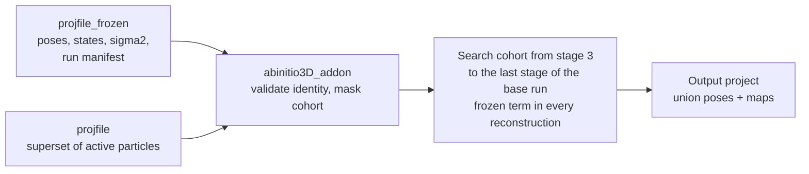

# abinitio3D_addon — development proposal

Date: 2026-09-25 (first draft 2026-09-24). Drafted against master `0bf593876`,
verified against master `3f5e6adce` on 2026-09-25 (section 8) and revised
after review (section 9). Nothing implemented yet.

## 1. Context and goal

abinitio3D has no way to take a converged solution and let a larger set of
particles grow it without re-searching the particles that built it. This
proposal adds `abinitio3D_addon`: given a frozen project (the accepted
solution) and a current project whose active particles are a superset of the
frozen ones, the particles not covered by the frozen solution are searched
against it while the frozen particles contribute their signal, unsearched, to
every reconstruction. The motivating case is a solution obtained on a harsh
class-average selection that the user wants to extend with the particles an
earlier, more permissive selection contained, to see what they add.

The workflow is defined by two projects, `projfile` and `projfile_frozen`, and
nothing else: the frozen project supplies poses, state labels, halves, its
own sigma2 state and, through the run manifest it registers, every setting of
the base run; the current project supplies the particles and their 2D
metadata; the two share one particle index space.

What exists today. The abinitio3D entry routes are a random start,
`cavg_ini`, `cavg_ini_ext`, `vol1` and state continuation (`state=`); none
takes a second project as a trusted, particle-backed solution, and `vol1`
treats its maps as untrusted and re-initialises poses by CC. `refine3D` with
`update_missing=yes` assigns particles with `updatecnt==0` in a single greedy
pass and is refused in probabilistic modes (`simple_strategy3D_matcher.f90`:
"update_missing requires matcher-owned assignment").

The gap: once a solution exists, particles outside it have no 3D pose, and the
only tools on hand either re-run everything or assign newcomers in a single
greedy pass against a fixed map. Neither lets the newcomers add signal to the
model while being searched properly.

## 2. Strategy in one page

In the first implementation the frozen project's particles are not searched;
the current project's other active particles are run through a standard
abinitio3D from the probabilistic stage on, with the frozen particles' Fourier
accumulators summed into every reconstruction as a second, constant set of
partials. The output is one
project carrying both cohorts' poses and the union maps. Updating the solution
with searches over all active particles is a later extension (section 6).



The output is an ordinary project: it can be inspected or refined with
`refine3D`; it becomes a valid frozen project for a later add-on only once the
union sigma state exists (section 3, "Sigma2").

The design reuses one existing object on both backends: the raw accumulator at
full dataset mass, which is what the trailing chain already is. Gridding trails
`trailrec_stateNN_{even,odd}` sums plus `rho` in `blend_trailing_accumulators`
(`simple_commanders_rec_distr.f90`), and PCG trails raw `(B,D)` pairs through
`add_raw_accum_weighted` in the distributed master
(`simple_rec3D_pcg_strategy.f90`); the PCG reader zero-extends a smaller
previous grid when the crop grows, the gridding reader only under a fractional
update (section 8, F6). A frozen contribution is the same artifact,
summed in like the partials of another partition: no coefficient, no decay,
never written into the chain. The reuse is the artifact and the reduction
step, not the trailing algebra (section 3, "How this differs from trailing").

| Piece | Owner today | Change |
| --- | --- | --- |
| Frozen accumulator set at every distinct consuming box, plus the native box | `calc_rec` + `reconstruct3D` (`trail_seed=yes` writes a full-mass chain seed) | Sibling handshake writes a `frozen_*` set instead of the chain, once per distinct box, run on a collision-proof copy of the frozen project (section 9, items 3.1 and 4.7) |
| Summing it into the reduction | `restore_state_from_parts`, PCG master reduction | One new step after the trailing blend, before restoration or priors |
| Which particles are frozen | nothing | Commander validates that the frozen project's active indices are active in the current project, masks them to `state=0` in its working copy, restores them with the frozen poses at the end |
| The workflow | `abinitio3D`, `abinitio3D_cavgs` (own UI entry, exec case, commander, shared `simple_abinitio_utils` helpers) | New `abinitio3D_addon` program: own UI entry and exec case, a thin wrapper commander in `simple_commanders_abinitio.f90`, and the shared flow of `exec_abinitio3D` behind an internal handshake; `nstates`, `pgrp`, the state volumes and every run parameter are read from the frozen project and its run manifest, never from the command line (section 4) |
| Sampling | `force_full_sampling_mode` (nsample/active > 0.9), class sampling, trailing chain | Unchanged, run on the masked cohort; the frozen term stays outside the cohort chain |

## 3. Frozen contributions

A frozen contribution is a per-state, per-half raw accumulator set built from
the frozen particles at each distinct consuming box, and at the native box,
and summed into the add-on run's current partials, as a second set of
partials, before any restoration or prior.

```text
gridding:  S_eo  = S_eo(cohort)  + S_eo(frozen)      Fourier sums
           rho_eo = rho_eo(cohort) + rho_eo(frozen)  sampling density
pcg:       B = B(cohort) + B(frozen)                 weighted RHS
           D = D(cohort) + D(frozen)                 Gram precursor, before end_accum
```

This is a plain union of two particle sets, not a fractional update: no `u/f`
scaling, no `1-u` decay. Sampling density and FSC then describe frozen plus
cohort, which is the model the cohort particles are being aligned to.

**How this differs from trailing.** Trailing has one population, all of it
searchable: each iteration a random fraction `f` is re-searched and yields
partials of mass `f*D`, and the chain is an exponential moving average,
`chain_t = (u/f)*current_t + (1-u)*chain_{t-1}`. The `u/f` makes a
fractional-mass partial stand in for the whole population; the `1-u` decay
makes stale poses fade at `(1-u)^k` until the particle is resampled and its
new pose replaces the old one. "Frozen per iteration" there means only "not
resampled this iteration": every pose keeps moving, the chain always holds
some contribution from poses `k` iterations old, total mass stays `D` by
convex mixing, and the chain is rewritten every iteration. Here there are two
populations. `F` has fixed poses for the whole run and is never searched; `C`
is searched in full every iteration (under full sampling; the sampled
recurrence is in section 4, "Sampling"). The reconstruction at iteration `t` is
`A_F + A_C(t)`: `A_F` is an actual full-mass reconstruction of `F`, computed
once and read-only; `A_C(t)` is the ordinary complete set of partials of `C`.
Nothing stands in for anything, so there is no `u/f`; nothing goes stale, so
there is no `1-u`; the mass is `|F| + |C|` because it is a union, not a
mixture. Two statements, not one (review item 5): at a fixed grid with fixed
per-particle weights, separately accumulated raw statistics of `F` and `C` add
to exactly the statistics a direct accumulation of the union would give, with
no memory of `C`'s earlier poses; with sigma curves estimated separately on
`F` and on `C`, the union is a cohort-specific weighting model whose agreement
with a one-shot reconstruction is empirical, measured by the
joint-versus-separate gate against a declared tolerance. The frozen term must stay outside the chain: if
`A_F` were folded in, the `1-u` decay would erode it by `(1-u)^k` unless
re-added, and re-adding while it is inside double counts. Keeping it separate
also means that when the cohort is sampled, trailing applies to `C` alone and
`A_F` is still summed in, unchanged, after the blend (section 4, "Sampling").

**Producer.** `calc_rec` (`simple_abinitio_utils.f90`) already runs
`reconstruct3D` on a project and, with the internal `trail_seed=yes`
handshake, writes the accumulators at full mass. A sibling, `calc_frozen_rec`,
builds its own local command object from `cline_reconstruct3D` and
`apply_refine3D_reconstruction_controls` (it never mutates the shared stage
command lines or `lpinfo`; section 9, item 3.1), sets `box_crop` to the box it
is asked for, passes the sibling handshake `frozen_seed`, and does no stage
renaming, injection or registration. It runs on a collision-proof copy of the
frozen project in the run directory (the frozen project itself is never
written to; section 8, F4, and section 9, item 4.7), once per distinct
consuming box. The writer targets a different artifact stem:
`frozen_stateNN_boxBBBB_{even,odd}` plus `rho` and a manifest on gridding, and
a `frozen` raw pair per box with its own provenance tag on PCG. Names must
avoid the `recvol_state` and `trailrec` stems so partial-reconstruction globs,
chain validation and cleanup never touch them.

**One accumulation per distinct box.** The stage plan
(`lpinfo(start_stage:nstages)%box_crop`, from the manifest) uses a handful of
distinct boxes; the commander runs one frozen accumulation per distinct box,
plus one at the native box for the final reconstruction. The first draft
proposed one native accumulation clipped to each box. The constant
field-of-view contract (`box*smpd == box_crop*smpd_crop`, padded lattices
exactly `2*box` on both backends) does make the Fourier sample locations
index-aligned, but the values deposited on them differ: the shared observation
contract `prep_rec_observation` (`simple_matcher_ptcl_io.f90`) noise-normalises
a cropped particle at the native box, Fourier-crops it and tapers it at the
cropped box, whereas an uncropped particle is tapered first and normalised
second; cropping and tapering do not commute, so a clipped native set is not
the set a consumer at that box would have accumulated, at low frequencies and
not only in a wrap rim (review item 3.1). The PCG chain's zero-extension of a
smaller previous grid is the opposite, deliberately lossy direction and is not
evidence for clipping. A single-traversal producer may be investigated later,
only after an exact equivalence is proved, and never by changing the shared
particle preprocessing. Padding is never used either: a set at a smaller box
than the consumer's is rejected by its manifest. The starting `vol1..volN` for
`start_stage` are the state volumes the native-box frozen reconstruction
writes anyway: `refine3D` crops every reference to the stage box on read, so no
restore-from-set entry point is needed (section 8, F7).

**Consumer.** Gridding: a new `add_frozen_accumulators()` step in
`restore_state_from_parts`, after `blend_trailing_accumulators()` and before
`sum_eos_before_density_correction_if_needed()`, reading through
`read_gridding_pair_accumulators` and `sum_reduce`, with the manifest validated
before the read. PCG: `add_raw_accum_weighted(frozen, weight=1.0)` in the
distributed half job and in the shared-memory half solve, after the chain
write and before `end_accum`, so `B`/`D` see the union and priors are applied
to the union. In both cases the trailing chain, if active, is written *before*
the frozen term is added, so the chain carries only the cohort's mass. The
frozen add must run before every zero-current early-out: the PCG half job
returns when `job%nptcls == 0`, and the gridding assembly carries a state
without partials forward from the previous iteration
(`determine_dropped_states`, `carry_forward_dropped_state`); a state or half
with a valid frozen set and no cohort contribution is assembled from the frozen
term alone, never skipped, carried or rejected (review item 4.6). The same add
is needed in both reconstructions of `bootstrap_rec3D`, which `calc_final_rec`
runs whenever the last stage was cropped; its bootstrap map is gridding by
design, for speed, and in add-on mode is built on the run's backend, so there
is one frozen kind (decided; section 8, F1 and F2). Activation is an internal
handshake carrying the frozen manifest path, set only on the in-process
assembly command lines the way `trail_seed` is today (neither is a
`parameters` field, so neither is in the generated argument vocabulary and
neither can be given on a command line); a consumer opens nothing without a
validated manifest bound to the run identifier (review item 4.1).

**Sigma2.** The frozen cohort's committed residual sigma2 is consumed by every
frozen accumulation; it is never re-estimated. The canonical state lives at
the native box (`fdim(box)-1` shells) and every cropped box uses a prefix of
those shells under the constant field-of-view contract. Canonical identity is
validated against `params%nptcls` and a layout digest over every row
(`sigma2_state_project_layout_digest`, `ensure_canonical_sigma_state` in
`simple_rec3D_strategy.f90`), and a mismatch would rebuild the state from
particle power spectra; running the accumulation on a plain copy of the frozen
project keeps its state resolvable (section 8, F4), and the add-on refuses a
frozen project whose committed residual state is not consumable rather than
accept an image-power seed in its place. The add-on run estimates its own
state for the cohort in the working copy, whose inherited registration the
commander deletes first, exactly as a fresh `abinitio3D` does; frozen rows are
`state=0` there and receive no records (`calc_pspec` computes `state>0` rows
only).

At the end the output project carries no cohort-only sigma registration: the
consumability check (`canonical_sigma2_consumable`: file size and group
checksum, then identity of box, sampling, shells, row count, layout digest,
grouping and committed state) does not look at the active set, so a
cohort-only state would pass once the frozen rows are active again and its
group curve would weight the union with the cohort's noise model (review item
3.4). The registration is removed, the output is marked not eligible as a
frozen input, and the next ordinary `refine3D` bootstraps a state for the
union. A scientifically composed union state (cohort rows from the add-on's
state, frozen rows from the frozen state, one group reduction over the union
through the candidate machinery of `simple_sigma2_state.f90`) is a later phase
and the precondition for chaining add-ons. One numerical gate accompanies the
weighting model: the identity test run once with sigmas estimated jointly on
`A u B` and once with the frozen rows from a run on `A` alone and the cohort
rows from the add-on, comparing maps and FSC against a declared tolerance.

**Provenance.** Each frozen set carries a manifest recording box, sampling,
total row count, frozen active count, state layout, backend and the add-on
run identifier; readers refuse the set on any mismatch, mirroring
`validate_trail_chain` and the PCG chain identity, and never fall back to a
reconstruction without the frozen term. A stale `frozen_*` file in a directory
activates nothing, because consumers open frozen sets only through the
handshake.

**Symmetry.** The frozen run is already on the target axis; the add-on runs
with `pgrp_start=pgrp`, so the frozen accumulation and the cohort partials are
replicated identically.

## 4. The abinitio3D_addon workflow

`abinitio3D_addon` is its own program with its own UI entry and exec case. Its
commander is a thin wrapper in `simple_commanders_abinitio.f90` that turns the
base run's manifest into a command line and hands it to `exec_abinitio3D`,
whose add-on route shares the sampling initialisation, stage loop and final
reconstruction ("Registration" below). It takes `projfile` and
`projfile_frozen`, inherits everything that describes the solution and the run
from the frozen project and its manifest, validates that the current project
is a superset by physical particle identity, and masks the frozen particles in
its own working copy, so refine3D needs no new sampling policy at all.

**Superset validation.** The two projects share one particle index space:
`projfile_frozen` was derived from `projfile`, or both from a common ancestor,
by selection. Equal row counts and an equal stack table do not prove that row
`i` is the same image, so the commander resolves every row of both projects
through the canonical mapping `map_ptcl_ind2stk_ind`
(`simple_sp_project_ptcl.f90`) for `ptcl2D` and `ptcl3D` and requires the same
source stack and physical image index row by row, the same particle source
(`ptcl_src`), and the same optics and CTF identity needed to reproduce the
frozen contribution (review item 4.4). Every index with `state > 0 .and.
updatecnt > 0` in the frozen project must be active in the current `ptcl2D`,
the segment that controls the fresh-start selection. A frozen member inactive
in the current project, a row permutation, a changed stack source, a
`ptcl2D`/`ptcl3D` selection mismatch, an optics or CTF mismatch, or a box or
`smpd` mismatch is a hard error naming the first offending index, raised before
any project is written. Membership is defined once:

```text
frozen = frozen state > 0 AND frozen updatecnt > 0
cohort = current ptcl2D active AND NOT frozen
```

An empty cohort is refused before masking. The commander reports the frozen,
cohort and never-updated counts before the first reconstruction.

**Option A, working-copy masking (recommended).** `params%new` with
`mkdir=yes` copies the current project into the run directory once; the
commander then saves the current `ptcl2D` state of every row and sets
`state=0` in both `ptcl2D` and `ptcl3D` for every frozen row. The mask is
installed before the established sampling initialisation reaches its counting
block, so abinitio3D machinery sees only the cohort everywhere it counts
particles (`count_state_gt_zero` counts active `ptcl2D` rows,
`reset_ptcl3D_from_ptcl2D_selection` derives the 3D state from the 2D state,
`gen_labelling` randomises only active rows, `get_state_update_fracs` counts
`state>0` rows), without any add-on-specific counting branch. The ptcl2D mask
is required because the fresh-start route resets `ptcl3D%state` from the 2D
selection. The frozen rows stay masked through search, reconstruction,
trailing-fraction consumption, the final missing-assignment coverage of the
cohort and the `addon_diag` reconstruction. Only then does the commander
restore them: the frozen project's 3D records through the canonical
`transfer_3Dparams` (projection, correlation, fraction, `sampled`,
`updatecnt`, `eo`, Euler angles and shifts) plus an explicit `state`, the
saved current `ptcl2D` state, and union-aware `res`/`res05` for the restored
rows (the final reconstruction writes those only for rows active at the time;
review item 4.5). No `frozen` row field is added: the orientation schema has
none and the algorithm does not need one; provenance lives in the run manifest
(review item 4.9). The output is one ordinary project with every particle
posed, which the user inspects or refines; it is not a valid frozen input for
a later add-on until the union sigma state exists (section 3, "Sigma2").

**Option B, cohort filter inside refine3D.** `sample4update_missing`
(`state>0 .and. updatecnt==0`) is the natural candidate, but it increments
`updatecnt` on the first pass and so selects nothing on the second iteration,
and the matcher refuses it under `prob_align`. Making it multi-iteration and
prob-compatible means a persistent cohort key consulted by `sample4update_*`,
`prob_align`/`prob_tab` reproduction and `sample4update_reprod`, plus the
trailing-fraction bookkeeping in `get_update_frac`. That touches the
importance-sampling contract in four modules for no gain over A. Keep B in
reserve for the case where the same project must serve both cohorts at once.

**Where `updatecnt` earns its keep: the freeze.** In the frozen project,
particles with `updatecnt > 0` were searched and are frozen; particles with
`updatecnt == 0` (never sampled when that run used `nsample` below the
full-sampling switch) are *not* frozen and join the cohort, together with the
particles only the current project activates. Chaining add-ons is not part of
the first release (section 3, "Sigma2").

**Inputs and the run manifest.** The add-on runs with exactly the settings of
the base `abinitio3D` run (Hans, 2026-09-25): a run parameter that differs
changes the model the cohort is aligned to. The command line therefore carries
only what governs compute effort, convergence and diagnostics; everything else
comes from one versioned run manifest written by the base run (review items
3.2 and 4.3):

- The manifest is a single, typed, versioned key-value file in the base run's
  directory, registered in `projinfo` by bare name and resolved against the
  project's own directory exactly like `sigma2_state`. It carries a schema
  version, a run identifier, a completion marker and a checksum; the project
  and particle-layout identity (row count, layout digest, stack table,
  `ptcl_src`, optics/CTF identity); the solution (`nstates` as the completed
  final state count, `pgrp`, box, `smpd`, `mskdiam`, `base_multivol_mode` and
  `split_stage` as provenance only); the reconstruction policy
  (`rec_backend`, `maxits_pcg`, `maxits_ml`, `pcg_solvent`,
  `pcg_solvent_lambda`, `filt_mode`, `automsk`, `envfsc`, `envmsklp`,
  `conical_fsc`, `projrec`, `objfun`, `sigma_est`); the search policy
  (`nstages`, first and last stage run, per stage the planned and the
  *emitted* `lp` and `lpstop`, `box_crop`, `smpd_crop`, `trslim`; `hp`, `lp`
  override, `lpstart`, `lpstop`, `force_lp_range` as given; `objfun_den`,
  `objfun_den_w`, `inpl_cont`, `ptcl_src`, `prob_athres`, `bfac`, `gauref`,
  `partition`); the effective `nsample` (the value the base run used, even when
  it came from the default that lives only in `params`); and the artifact
  inventory (state maps, halves, FSCs, sigma state) with digests. The base
  run's `nptcls_eff`, `update_frac`, realized fractions and full-sampling
  result are recorded as provenance and never copied into the add-on's
  execution state: they are outputs of the base population, and the add-on
  derives its own from the masked cohort. Planned limits alone are
  insufficient because FSC=0.5 promotion changes the limits a base run actually
  matched at; the add-on matches at the emitted ones with promotion off.
- `exec_abinitio3D` always writes the manifest at the end of a completed run,
  atomically and last; a manifest-write failure never fails or alters the
  completed run. The manifest is the only route into the add-on (Hans,
  2026-09-25): no opt-in, no export program, no re-derivation from `jobproc`
  or from FRCs, and no command-line override of an inherited value. Expert
  overridables may come later as an explicit, separately reviewed extension.
  The add-on writes its own manifest, marked not eligible as a frozen input
  until the union sigma state exists.
- The add-on never replays a stored command line. The project's `jobproc` row
  of the base run (appended by `update_job_descriptions_in_project` after the
  commander returns, with `mkdir=no` and the base run-directory `projfile`
  already substituted) is provenance and the writer's source for the input
  keys; it is not executable. The add-on builds a fresh sparse command line
  from an explicit allowlist of manifest fields, normalises both project paths
  before any change of directory, calls `params%new` exactly once with
  `mkdir=yes`, and refuses unknown schema fields and unknown keys. Entry,
  execution, partition, range, iteration, trailing and frozen controls are
  never inherited; each child receives only the fields it needs.

Inheriting the ladder means the frozen sets are accumulated at the boxes the
base run used and the union is matched at the limits the base run was matched
at. The add-on never plans limits from class FRCs, on either project, and a
frozen project without a manifest is refused (Hans, 2026-09-25). A base run
bootstrapped through `cavg_ini=yes` or `cavg_ini_ext=yes` is inherited as a
finished solution; the add-on never runs `abinitio3D_cavgs` and never aligns
class averages (Hans, 2026-09-25).

The command line, from the CLI review of 2026-09-25 (Hans). Refusal is by key,
not by value, so a user cannot silently "confirm" an inherited value. The
parser accepts any key of the generated vocabulary for any program, so
ordinary `abinitio3D` and `abinitio3D_cavgs` refuse `projfile_frozen` and
`addon_diag` explicitly (review item 4.1).

| Group | Keys | Status in `abinitio3D_addon` |
| --- | --- | --- |
| Required | `projfile`, `projfile_frozen` (new) | accepted |
| Compute | `nparts`, `nthr` | accepted |
| Sampling and convergence | `nsample`, `overlap` | accepted; `nsample` defaults to the base run's effective value |
| PCG solve budget and checks | `maxits_pcg`, `maxits_ml`, `pcg_solvent_check` | accepted |
| Diagnostics | `euclid_diag`, `addon_diag` (new) | accepted |
| Same as the base run | `rec_backend`, `pcg_solvent`, `pcg_solvent_lambda`, `projrec`, `pgrp`, `center`, `cenlp`, `inpl_cont`, `multivol_mode`, `nstages`, `nstates`, `split_stage`, `objfun_den`, `objfun_den_w`, `ptcl_src`, `conical_fsc`, `envfsc`, `envmsklp`, `filt_mode`, `force_lp_range`, `hp`, `lp`, `lpstart`, `lpstop`, `lpstart_ini3D`, `lpstop_ini3D`, `mskdiam`, `automsk` | from the manifest; refused if given |
| Entry routes and their controls | `vol1`, `cavg_ini`, `cavg_ini_ext`, `pgrp_start`, `state`, `nthr_ini3D` | refused: the add-on has one entry route, no ini3D phase, and sets `pgrp_start=pgrp` |

Review notes on the labels:

- `center` cannot follow the base run. Centring runs only for a single-state
  run with `center=yes`, a cyclic point group, shifts on and no fractional
  update (`simple_matcher_refvol_utils.f90:211`); it re-centres the
  reference each iteration and maps the shift onto every particle of the
  state (`map3dshift22d`). The frozen accumulators never receive that shift,
  so the cohort's frame would drift away from the frozen term. Because the
  fractional update of a sampled base run disables centring, a full-sampling
  add-on would be the first place it could fire. The add-on forces
  `center=no`, and `cenlp` is then unused. The base run's own centring, if
  any, is harmless: its final poses and maps agree with each other.
- `overlap` has no effect in `abinitio3D` today: the stage controller emits
  its own per-stage values (0.99 up to the symmetry-search stage, 0.9 for
  stages 4 to 6, 0.95 after) and overwrites the top-level key. Accepting it is
  harmless; it becomes useful only if the add-on's stage-3 early stopping
  reads it (section 7).
- `maxits_pcg` and `maxits_ml` change the solved map slightly through solver
  convergence, not through the model; the final reconstruction keeps its floor
  of five iterations.
- `lpstart_ini3D` and `lpstop_ini3D` are inert in the add-on (no ini3D phase);
  listing them as "same as base run" costs nothing.
- `multivol_mode` and `split_stage` are inherited as provenance only; the
  add-on's own mode follows the final frozen state count ("Multi-state"
  below).
- Keys the UI never exposes but the base run set (`prob_athres`, `bfac`,
  `gauref`, `partition`, `sigma_est`, `objfun`) are manifest fields, recorded
  by the writer from the base run's `jobproc` row.

**Registration.** `new_abinitio3D_addon` in
`src/main/ui/simple/simple_ui_abinitio3D.f90` (11 inputs) and a
`case('abinitio3D_addon')` in `src/main/exec/simple_exec_abinitio3D.f90`, as
for any program with its own command-line contract. No new commander file and
no second workflow (Hans, 2026-09-25): `commander_abinitio3D_addon` is a thin
wrapper type in `simple_commanders_abinitio.f90`, on the pattern of
`commander_abinitio3D_cavgs_conditional_restarts` in the same file. Its
`execute` reads and validates the manifest and both projects before any
directory change, builds the allowlisted command line, sets the internal
add-on handshake (`addon_manifest=<path>`, outside the generated vocabulary,
so no command line can set it) and calls `exec_abinitio3D`. `exec_abinitio3D`
gains one entry route selected only by that handshake, beside `state=`,
`cavg_ini`, `cavg_ini_ext` and `vol1`: a prologue after the project read
(collision-proof frozen copy, physical-identity validation, mask, drop of the
inherited sigma registration), a planning branch (the ladder from the manifest
instead of `set_lplims_*`), a starting-volume branch (reset, random
orientations and labels on the cohort, the per-box frozen sets, the native
frozen references as `vol1..volN`), the add-on context passed into
`set_cline_refine3D` and the final reconstruction, and an epilogue before the
final GUI update (`addon_diag`, restore, sigma unregistration, own manifest).
The sampling initialisation, the stage loop, the final reconstruction, the
multi-state coverage helpers and the GUI updates are shared unchanged; a
standalone commander would have duplicated about 370 of the 760 lines of
`exec_abinitio3D` and its contained helpers. The only justification for the
wrapper is that the exec router needs a target and the manifest must be
translated into a command line before `params%new`; an ordinary `abinitio3D`
never carries the handshake and its behaviour is byte-identical.

**Flow.**

- `pgrp_start = pgrp`; the symmetry axis was settled by the frozen run, so no
  axis search and no `symmetrize` call. `center=no` whatever the base run
  did: a re-centred reference maps a shift onto the cohort particles that the
  frozen accumulators never receive.
- `start_stage = PROB_REFINE_STAGE` (3): cohort particles get `rnd_oris`,
  uniform random state labels across every inherited state when `nstates>1`,
  and their first assignment comes from the stage-3 `refine=prob` search at
  the base run's emitted stage-3 limit. Compare the `vol1` route of
  `abinitio3D`, which enters at stage 4 after a CC pose-initialisation pass
  because its references are untrusted; here they are trusted, so that pass is
  skipped. Decided: stage 3 (Hans, 2026-09-25). The add-on's stage 3
  early-stops on `overlap`, since the symmetry search that keeps stage 3 at
  full budget never runs here (section 7, question 7).
- The last stage is the base run's last stage, from the manifest: a
  single-state run went to stage 8 (`NSTAGES`, `prob` then `prob_neigh`, NU
  filtering from stage 6); an `independent` multi-state run stopped after
  stage 5 with `lpstop` 6 A (`NSTAGES_INDEPENDENT`, `LPSTOP_INDEPENDENT`), or
  earlier if its `nstages` said so; a docked base run completed through stage
  8 under `refine3D_states`, and the add-on runs `independent` stages 3 to 8
  ("Multi-state" below) on its ladder: the controller's emitted limits up to
  the split, the planned limits after it, where `refine3D_states` ran its own
  schedule between them. The add-on cannot lower or raise the last stage.
- Starting references come from the native-box frozen reconstruction; its
  state volumes are the stage-3 `vol1..volN` as they are (section 8, F5 and
  F7). The per-box frozen sets are produced before the stage loop, one per
  distinct box of the ladder plus the native box. The frozen-only native
  reconstruction is also a provenance check for free: compared with the base
  run's registered final state maps at the matching band, agreement shows
  that poses, halves, sigmas and settings were reproduced; in the first
  release a discrepancy beyond tolerance is reported as a warning, and the
  end-to-end scenario decides whether it becomes a refusal.
- Stage schedule, `nspace`, `ml_reg`, `frac_best`, early stopping and backend
  policy stay exactly as `build_refine3D_stage_cfg` emits them for stages 3 to
  `nstages`. The controller gains no add-on branch beyond an explicit,
  immutable add-on context passed as an optional argument (absent means the
  legacy path; review item 4.2) that switches the FSC=0.5 stage-LP promotion
  (`FSC05_PROMOTE_MIN_STAGE`) off, because the FSC reflects the frozen
  population and would promote the cohort past the inherited ladder, and
  enables stage-3 early stopping.
- The stage ladder (emitted LP and crop per stage) is the base run's, read
  from the manifest; there is no re-planning from the current project's FRCs
  and no `lpstart`/`lpstop` override.
- Before the first stage whose policy has `trail_rec=yes`, the stage-boundary
  reconstruction of the working copy writes a full-mass, cohort-only chain seed
  at the consuming box with the current cohort poses, through the existing
  `trail_seed` handshake; the frozen term is added to that reconstruction's
  output but is never written into the seed. A missing, stale or incompatible
  cohort chain at a trailing stage rebuilds the seed or fails before any
  iteration output; add-on mode never enters the legacy union-volume bootstrap
  (review item 3.3).
- Optional diagnostic, `addon_diag=yes`: a cohort-only reconstruction at the
  native box, run while the frozen rows are still masked and without the
  frozen term, so the newcomers' own map and FSC can be compared with the
  frozen project's maps and the union.

**Sampling.** `nsample` is accepted (Hans, 2026-09-25) and defaults to the
base run's effective value from the manifest. After masking, the established
sampling initialisation runs unchanged on the cohort: it derives `nptcls_eff`
from the active `ptcl2D` rows, decides the regime with the existing switch
(`nsample/cohort > 0.9` forces full sampling, otherwise
`update_frac = min(UPDATE_FRAC_MAX, nstates*nsample/cohort)`), and later
`get_update_frac`/`get_state_update_fracs` count `state>0` rows only, so every
denominator is the cohort's. The sample-once-and-reproduce handshake is
untouched: `prob_align` selects from the active cohort and writes `sampled`,
`prob_tab` and `refine3D_exec` reproduce that subset, and no frozen index can
enter the outer subset, an inner probability table or a realized fraction.
Under a sampled cohort the reconstruction obeys

```text
P_C(s,h,t) = sampled cohort raw partial
T_C(s,h,t) = (u_s/f_s) * P_C(s,h,t) + (1 - u_s) * T_C(s,h,t-1)
U(s,h,t)   = F(s,h) + T_C(s,h,t)
```

per state `s` and half `h`, with the realized fraction `f_s` and the applied
weight `u_s` state-local as today; the cohort chain `T_C` is published before
`F` is added, and restoration, FSC, priors and NU filtering consume `U`. A
state or half with a chain but no current sample keeps its chain unchanged
(weight zero); one with neither has zero cohort mass and `U = F`. When the
inherited stage policy has `trail_rec=no`, the union is `F` plus the current
cohort partial and no trailing is introduced. Sampled and trailing PCG
assembly is supported in shared memory as it is: the shared-memory `refine3D`
strategy has its matcher write one raw partial through
`execute_rec3D_pcg_worker` and assembles through
`execute_rec3D_pcg_distributed_master` (`simple_refine3D_strategy.f90:750`),
the same master the distributed strategy uses (line 1234), which owns the
accumulator-domain fractional and trailing path. The refusal of
`update_frac`/`trail_rec` in `validate_supported_mode` belongs to the
standalone in-memory `reconstruct3D` PCG strategy (`execute_rec3D_pcg_shared`,
chosen below `nparts=2`, `simple_rec3D_strategy.f90:149`), which the add-on's
own reconstructions never reach with a fractional update: `calc_frozen_rec`,
the stage-boundary `calc_rec` and the final reconstruction carry none, and
`trail_seed` is supported there. That standalone path is where the
shared-memory frozen add of section 8, F2, is needed. Its refusal does bite
two existing routes today, the `vol1` checkpoint reconstruction and the docked
split checkpoint (`current_sample_only`), on PCG without `nparts>1`; the fix,
routing the in-memory PCG `reconstruct3D` through the same worker-plus-master
pair the shared-memory `refine3D` already uses, is a separate change (section
10, 2026-09-25). A base `nsample` of 10 000 on a cohort of 8 000 runs full
sampling without any user action.

**Multi-state.** The add-on mode follows the base run's completed final state
count: one frozen state gives `single`, more than one gives `independent`,
whatever the base run's own `multivol_mode` was; `base_multivol_mode` and
`split_stage` are provenance only (review item 4.8, product requirement). All
final frozen state references are present from stage 3, frozen rows keep their
labels, cohort rows get uniform initial labels across every inherited state,
and the ordinary `independent` `prob`/`prob_neigh` policies update the cohort;
`ensure_multistate_particle_assignments` runs on the cohort, frozen rows still
masked, before the final reconstruction. No consensus accumulator, no split at
the base run's `split_stage`, no `prob_state`, no docked geometric
neighbourhood and no sticky class sampling are constructed: the heterogeneity
policy gives `abinitio3D` only the single-state scaffold and split checkpoint
of docked work and `refine3D_states` its completion
(`doc/policies/heterogeneity/refine3D_states_policy.md`), and the add-on adds
no second docked production path. Every inherited state is carried through the
run: a state without cohort particles is reconstructed from its frozen term
(section 3, "Consumer") and registered with its union population. Parity gate:
completed N-state products from an `independent` and from a docked base run
enter the same add-on policy, differing only in their inherited states, maps,
ladder and data.

## 5. Architectural considerations

Every change lands in the subsystem that already owns the concern;
`abinitio3D_cavgs` is not entered by the new program, and `exec_abinitio3D`
only through its add-on route behind the wrapper's internal handshake.

| Subsystem | Change | Untouched |
| --- | --- | --- |
| `src/main/ui/simple/simple_ui_abinitio3D.f90`, `src/main/exec/simple_exec_abinitio3D.f90` | `new_abinitio3D_addon` program entry (11 inputs: `projfile`, `projfile_frozen`, `addon_diag`, `nsample`, `overlap`, `maxits_pcg`, `maxits_ml`, `pcg_solvent_check`, `euclid_diag`, `nparts`, `nthr`); `case('abinitio3D_addon')` | `abinitio3D`, `abinitio3D_cavgs` entries |
| `src/main/commanders/simple/simple_commanders_abinitio.f90` | `commander_abinitio3D_addon` wrapper type: manifest read and validation before any write, allowlisted command line, internal handshake. Add-on route in `exec_abinitio3D`: prologue (collision-proof frozen copy, physical-identity validation, saved `ptcl2D` state and mask, registration drop), mode from the final state count, ladder from the manifest, per-box `calc_frozen_rec` and native references, add-on context through the shared stage loop and final reconstruction, cohort-only chain seeding, epilogue (`addon_diag` while masked, `transfer_3Dparams` restore, union metadata, sigma unregistration, own manifest, transactional publication). Manifest write at the end of every ordinary run; refusal of `projfile_frozen`/`addon_diag` on the two ordinary entries | The ordinary routes, byte-identical without the handshake |
| `src/main/abinitio/simple_abinitio_controller.f90` | Optional add-on context argument: FSC=0.5 promotion off, stage-3 early stopping on `overlap`; an absent context is the legacy path | `NSTAGES`, `NSPACE`, `MAXITS`, mode/backend/trailrec policies |
| `src/main/abinitio/simple_abinitio_utils.f90` | `calc_frozen_rec` beside `calc_rec` with the `frozen_seed` handshake on a local command object; manifest writer and reader; no new module-level mode flag | Stage-boundary reconstruction semantics, `lpinfo`, shared command lines |
| `src/main/commanders/simple/simple_commanders_rec_distr.f90` | `add_frozen_accumulators()` in `restore_state_from_parts` after the chain write and before restoration, ahead of the dropped-state logic; manifest check before the read; union counts for populations | Trailing blend, restoration, FSC, NU inputs |
| `src/main/strategies/parallelization/simple_rec3D_pcg_strategy.f90` | Frozen raw pair summed into the reduction in the distributed half job and in the shared-memory half solve, after the chain write, before `end_accum` and ahead of the `job%nptcls == 0` return (section 8, F2; review item 4.6) | Solver, priors, support, chain identity |
| `src/main/sigma2/simple_sigma2_state.f90` | Nothing in the first release; the union state composition (row import by index, union group reduction, commit) is the later phase that unlocks chaining | Transaction, validation and commit semantics |
| `src/main/project` | Physical-identity superset helper on `map_ptcl_ind2stk_ind`; manifest registration by bare name beside `sigma2_state`; last-job lookup in `jobproc` for the manifest writer | Segment layout |
| `src/defs/simple_refine3D_fnames.f90` | `frozen_*` artifact names, per state and box | Existing stems and globs |
| `src/main/params` | `projfile_frozen`, `addon_diag` only; no `frozen_rec`, no `fsc05_promote`: the frozen context and the seed handshake are internal command-line keys outside the generated vocabulary, like `trail_seed` | Everything else |
| `src/main/simple_final_rec.f90`, `src/main/commanders/simple/simple_commanders_refine3D.f90` (`exec_bootstrap_rec3D`) | Forward the frozen context into the final and bootstrap reconstructions, build the bootstrap map on the run's backend under that context, drop the key from the `calc_pspec` line (section 8, F1 and F3) | Sigma bootstrap sequence |
| `src/main/sigma2/simple_sigma2_bootstrap.f90` | Delete the frozen keys wherever `trail_seed` is deleted (section 8, F3) | Bootstrap rule |

Rules this design keeps (from `simple-frac-update-trailing`, `simple-refine3d`,
`simple-architecture`) and the review's compatibility invariants (section 9):

- Producer writes what the consumer expects: the frozen set is accumulated at
  every consuming box by the same `reconstruct3D` that produces the chain seed,
  through the unchanged observation contract, and the reader validates the
  manifest rather than accepting a mismatch.
- Accumulators, not volumes, are the source of truth. Blending frozen and
  cohort *maps* would double-regularise and break the sampling-density
  weighting; the sum happens on raw sums and `rho` (or `B` and `D`) before any
  restoration or prior.
- The matcher's single-read particle I/O and partial-reconstruction handoff are
  untouched; the add-on run's partials are ordinary partials of a smaller
  active set.
- `volassemble` stays the execution site for volume-domain work; the frozen
  add is one more step there, not a new commander.
- `ui -> exec -> commander -> strategy/domain` is preserved: the program has
  its own UI entry and exec case, its two public keys are registered in
  `parameters`, and the commander consumes typed fields after `params%new`.
- Existing workflows keep their contracts: with no add-on context every shared
  reconstruction site behaves exactly as today before it opens any frozen
  artifact, changes a command line, alters an accumulator or changes cleanup;
  `abinitio3D` gains the manifest write, the refusal of the two add-on keys
  and an add-on route reachable only through the wrapper's internal
  handshake, `abinitio3D_cavgs` only the refusal; no add-on mode lives in
  module-global state;
  frozen names, readers, writers and cleanup are disjoint from `recvol_state*`,
  `trailrec*` and every existing glob; both input projects and their sigma
  states are byte-unchanged on success and on every injected failure.

Deliberate non-goals for the first cut: no cohort filter inside refine3D, no
frozen term in the trailing chain, no re-search of frozen particles (see
section 6 for the later all-particle update), no chaining of add-ons until the
union sigma state exists, no single-traversal frozen producer until its
equivalence is proved.

Tests, as `simple_<thing>_tester.f90` suites under `simple_test_exec` (the
review's approval gates, section 9, in condensed form):

- Original-application isolation: ordinary `abinitio3D` and
  `abinitio3D_cavgs` retain equivalent child commands, project segments,
  numerical outputs and artifact inventories with no add-on request, across
  single/independent/docked, sampled/full, gridding/PCG, shared/distributed;
  valid and stale `frozen_*` files in the directory are never opened; add-on
  keys are refused on ordinary and direct `refine3D`/`reconstruct3D` entries;
  ordinary-to-add-on-to-ordinary and the reverse order in one process leak no
  state; injected manifest, producer, consumer and final-write failures leave
  the source projects and completed ordinary output unchanged.
- Fixed-grid numerics, both backends, shared and distributed, C1 and non-C1:
  direct `F u C` accumulation equals separately accumulated `F + C` on raw
  statistics and on restored/solved maps with fixed sigma inputs; over at
  least two sampled iterations `T_C = (u/f) P_C + (1-u) T_C_prev`, the
  persisted chain holds no frozen mass and the consumed union is `F + T_C`;
  the coefficient of `F` stays one through seeding, steady state, box
  transitions, every PCG operator replay and the final reconstruction; a
  deleted or corrupt cohort chain is rebuilt or fails before output; N=1 and
  N>1 including a state or half with no cohort contribution and a frozen-only
  state, every inherited state producing maps, FSC and union metadata; FSC,
  NU/ML inputs and final maps use union half-statistics; the
  joint-versus-separate sigma gate with its declared tolerance.
- Sampling and state policy: sampled IDs identical across `prob_align`,
  `prob_tab`, the matcher and reconstruction with no frozen index; every
  denominator is the cohort's, at, below and above the 0.9 switch including
  `nstates*nsample`; sampled and full runs for two and three states on both
  backends, sampled PCG in shared memory (worker plus master in process) and
  distributed with several parts; independent and docked base fixtures enter the same `independent`
  add-on policy; final coverage touches cohort rows only and leaves frozen
  labels and poses unchanged.
- Project and provenance: manifest round trip, schema refusal, truncation,
  checksum, run-identifier, box/backend/layout and stale-set refusal;
  same-basename projects, same-file and symlink aliases, empty cohort,
  permuted rows, changed stack mapping, optics/CTF mismatch; source hashes
  unchanged after success and each injected failure; `addon_diag` contains the
  cohort only.
- End to end on a real data set: solution on a strict class-average
  selection, add-on with the permissive selection, union FSC and cohort-only
  map compared with a one-shot run on the permissive selection; scientific
  validation, not a substitute for the gates.

Compilation and runs stay with the user, per the repository policy.

## 6. Full-particle update passes

A full-particle pass re-opens every pose against the union model. It is not
part of `abinitio3D_addon`: the add-on's output is an ordinary project with
every particle posed, so the pass is a subsequent refinement of that project,
and when it is run is the caller's policy.

**Why it is needed.** Frozen poses were found against a smaller-population,
lower-resolution model, and each add-on cohort is only ever refined against
the model it joined. Without an occasional pass the solution ratchets:
newcomers improve the map, but the particles that built it never benefit, and
in multi-state runs the state partition never changes.

**What it is.** All particles active, standard `update_frac`/`nsample`
sampling and `trail_rec`, seeded from a full reconstruction through
`trail_seed`. Two candidate carriers: `refine3D` with the inherited `nstates`
(`refine=prob` then `prob_neigh`, the emitted controls of stages 5 and later),
or the abinitio3D state-continuation route (`state=`), which today requires
`multivol_mode=single` and would need an `independent` extension. The first
reuses more and keeps the states coupled; the second gives the NU ladder for
free. Decide once the add-on exists and its outputs can be inspected.

**Interaction with add-ons.** Whether a refined project can be the frozen
project of a later add-on is open (section 7, frozen input scope): it carries
no `abinitio3D` manifest of its own and its maps no longer match the base
manifest's digests. Frozen accumulator sets are never reused across runs; each
add-on regenerates them at its own stage boxes.

## 7. Risks, open questions and plan

The numerics are a straight sum of artifacts that already exist; the risk sits
in the policy edges around them.

Risks:

- Frozen mass dominates the FSC, so any FSC-driven control (stage-LP
  promotion, NU band selection, early stopping on resolution) sees the frozen
  model, not the cohort. Promotion is switched off; the NU ladder is reached
  exactly where the base run reached it, and `overlap`-based early stopping is
  computed on the cohort only.
- A junk-rich cohort barely moves the map but is posed and written into the
  output all the same. The run reports per-state populations and the union
  resolution against the frozen project's, and `addon_diag` shows the cohort
  on its own; rejecting the outcome is the user's call.
- The frozen partition never changes inside an add-on; a later chain of
  add-ons without a refinement pass would keep the first solution's states
  forever.
- The output must not be mistaken for a frozen input: its sigma registration
  is removed and its manifest marks it ineligible until the union sigma state
  exists (section 3, "Sigma2").
- Sigma2: the cohort's sigma2 is estimated on its own population; the
  joint-versus-separate gate measures the effect before it is trusted.
- Disk and compute: one frozen accumulation per distinct stage box per state
  plus the native box, a handful in total, each a full pass over the frozen
  particles.
- A cohort too small for a stable multi-state assignment; enforce a floor on
  the cohort size per inherited state and refuse below it (open items below).

Decided (Hans, 2026-09-25): enter at stage 3; `nsample` is accepted; one
frozen kind, the bootstrap map runs on the run's backend in add-on mode; no
limit is ever planned from class FRCs, a frozen project without a manifest is
refused; the frozen term is an `abinitio3D` capability only, nothing is routed
through `refine3D_states`; the class-average route is off, the add-on aligns
particles only; the sigma2 union is deferred. Review disposition (section 9):
the frozen set is accumulated per consuming box, the add-on mode follows the
final frozen state count with docked as provenance, sampled and full cohorts
are both first-release, and the output is not chainable until the union sigma
state exists. The manifest is the only route (Hans, 2026-09-25): always
written by the base run, no opt-in, no export, no re-derivation, no override;
expert overridables are a possible later extension. No new commander file: a
thin wrapper commander in `simple_commanders_abinitio.f90` and an add-on route
in `exec_abinitio3D` behind an internal handshake, sharing the sampling
initialisation, stage loop and final reconstruction (Hans, 2026-09-25).

Open before implementation (2026-09-25, evening):

- Frozen input scope: the direct `abinitio3D` output only (the manifest's
  artifact digests must match the project's registered maps), or also a
  `refine3D`-refined descendant? Mechanically a descendant still resolves the
  manifest, because `refine3D` never rewrites the project's recorded
  directory, and it carries its own consumable sigma state; its registered
  maps would no longer match the manifest digests. Recommendation: direct
  output only in the first release.
- Cohort floor numbers: a hard floor of 5 cohort particles per inherited
  state (the docked split's `MIN_SPLIT_STATE_POP`) and a warning below 5 % of
  the frozen population.
- Stage-3 early stopping: `overlap` defaults to 0.95 (the `abinitio3D` entry
  default) rather than the 0.9 of stages 4 to 6.
- The joint-versus-separate sigma tolerance is set from the first real-data
  run (map correlation and FSC difference reported, a gate value proposed
  afterwards), not guessed now.

Implied by the decided rules, recorded so they are not re-asked: a frozen
project must be a completed run with its final native-box reconstruction and
committed residual sigma state (an early-stopped run has neither at native
sampling and is refused); an empty inherited state breaks the contiguous
`1..N` layout and is refused; the manifest file and its `projinfo` key are
named after the program (`abinitio3D_manifest`).

Decision matrix for the remaining questions. The verdict column is a
recommendation; the decision stays with Hans.

| # | Question | Option | Correctness and fidelity | Code touched | Compute | Failure mode | Verdict |
| --- | --- | --- | --- | --- | --- | --- | --- |
| 1 | Frozen rows with `updatecnt==0` | a. join the cohort | Correct: the base run's maps never contained them (`reconstruct3D` selects `state>0 .and. updatecnt>0`, `sample4rec`; the PCG master skips `updatecnt<1`), so the frozen accumulation excludes them by the existing rule and they are newcomers by definition | cohort count and a log line | proportional to their number | none | recommended |
| 1 | | b. exclude them from the run | Discards active particles of the current project; a chain of add-ons never poses them | one mask | lower | silent particle loss | no |
| 1 | | c. freeze them | Wrong: their poses are `rnd_oris` leftovers | an override of the accumulation rule | none | random-pose signal in the frozen term | no |
| 2 | NU-filter inputs | a. the union, by construction | The frozen sum precedes restoration; gridding captures the NU inputs from the restored halves, PCG filters the solved maps | none | none | none | recommended; close |
| 2 | | b. cohort-only NU inputs | Filters on a cohort-only FSC, worse than the union's, and the matching references stop being the shipped model | a second restoration per state and iteration | one extra restoration per iteration | inconsistent references | no |
| 3 | Full-particle pass | out of scope | The add-on's output is an ordinary project; the pass is a later refinement whose carrier belongs in its own note | none here | | | deferred, not an add-on decision |
| 4 | Cohort floor per state | a. absolute hard floor only | Prevents degenerate paths (balanced `gen_labelling`, per-state halves); `randomize_states` refuses at `MIN_SPLIT_STATE_POP=5` | one check | | a tiny cohort runs and changes nothing, unnoticed | partial |
| 4 | | b. fraction of the frozen population as a hard floor | Refuses legitimate small add-ons; a few hundred good particles are worth posing | one check | | over-refusal | no |
| 4 | | c. absolute hard floor plus a warning below a fraction (5 % of the frozen population) | Degenerate runs refused, small runs allowed and flagged | two checks | | none | recommended |
| 5 | Manifest carrier | a. one versioned key-value file, bare name resolved against the project directory (accepted, review item 4.3) | Mirrors `sigma2_state` exactly; human-readable; per-stage arrays are natural | writer, reader, one `projinfo` key | | a relocated project loses it, as it loses its sigma state; refused loudly | decided (Hans, 2026-09-25) |
| 5 | | b. derived keys pushed onto the command line so they land in the `jobproc` row | Travels with the project, but derived values masquerade as inputs, must be stripped before `params%new`, and the row is written by the executable after the commander returns | cline push plus strip logic | | unknown keys reaching the parser | no |
| 5 | | c. keys in `projinfo` | Travels with the project; `projinfo` is project identity, thirty stage keys clutter it and a chain overwrites them | a setter and getter per key | | none | no |
| 6 | Docked base run | a. refuse | Nothing wrong, nothing supported | none | | docked users excluded | no: docked results are required multi-state inputs |
| 6 | | b. translate: mode from the final frozen state count, `independent` `prob`/`prob_neigh` over the co-aligned frozen states | The frozen term pins the references, so the drift that motivates docked mode cannot occur; early state labels at low resolution are noise but harmless; the docked route is provenance | a mode derivation | N references per particle from stage 3 | none structural | decided (product requirement, review item 4.8) |
| 6 | | c. in-line docked particle loop with a consensus set and the controller's docked policies | Would be a second docked production path, which the heterogeneity policy reserves to `abinitio3D`'s scaffold plus `refine3D_states` | consensus sum, split-stage labelling and reconstruction | | policy conflict | declined |
| 7 | `overlap` | a. keep, inert | The controller overwrites it per stage | none | | a knob that does nothing | no |
| 7 | | b. drop from the entry | Honest | one line | | none | acceptable |
| 7 | | c. drive the add-on's stage-3 early stopping (add-on context) | Stage 3 lacks early stopping only because of the symmetry search, absent here; gives the accepted key a meaning; default 0.95 | two lines in the controller | saves most of the 17-iteration stage-3 budget when the cohort converges early | an early stop on a cohort that has not settled; the base run's stages 4 to 6 accept the same risk at 0.9 | recommended |

Phased plan:

| Phase | Scope | Gate |
| --- | --- | --- |
| 1 | Frozen accumulator contract at a fixed grid: `frozen_seed` writer on a local command object in `calc_frozen_rec`, per-box producer, `frozen_*` names per state and box, frozen add in gridding `restore_state_from_parts`, the PCG distributed half job and the shared-memory half solve ahead of every zero-current early-out, internal frozen context with manifest validation, forwarding through `calc_final_rec` and `bootstrap_rec3D` with the bootstrap map on the run's backend, cohort-only chain seeding and the sampled recurrence | Fixed-grid numerical gates (section 5); joint-versus-separate sigma gate |
| 2 | Run manifest: writer at the end of `exec_abinitio3D` (atomic, published last, non-fatal), reader with schema, run-identifier, checksum and layout validation, allowlisted command-line construction, `jobproc` last-job lookup for the writer | Project and provenance gates |
| 3 | `abinitio3D_addon` program: UI entry, exec case, wrapper commander and the add-on route in `exec_abinitio3D` per the first-cut contract (section 9): identity validation before any write, collision-proof copies, saved `ptcl2D` state and mask, registration drop, mode from the final state count, per-box accumulation, stage-3 entry with `center=no`, sampling initialisation unchanged on the cohort, promotion off, frozen-only states, coverage and `addon_diag` while masked, `transfer_3Dparams` restore, union metadata, sigma unregistration, own manifest | Isolation, sampling and state-policy gates; strict-versus-permissive scenario on a real data set |
| 4 | Union sigma state composition, then chaining; the full-particle pass (section 6) in its own note | `A -> A+B -> A+B+C` with a valid union sigma state |

Phase 1 can be developed and tested with two hand-made projects before any
commander work starts, which keeps the numerics reviewable on their own.

## 8. Verification against master `3f5e6adce` (2026-09-25)

Every symbol, constant and mechanism the note relies on was checked against
the tree. Inside the files this design touches, the only source change since
the drafting base is one initialisation line in
`simple_strategy3D_matcher.f90`, so the note is drafted against the current
code.

Confirmed as written: the entry routes and the `update_missing` refusal
(`simple_strategy3D_matcher.f90:407`); the `trail_seed` handshake in
`calc_rec`, gated on the consuming stage's `trail_rec`, and its writers in
`blend_trailing_accumulators` and `prepare_distributed_half_job`; the
manifest fields `validate_trail_chain` checks; the constant-FOV zero-extension
of `add_raw_accum_weighted` with its nested-lattice, extent and provenance
checks; `force_full_sampling_mode` and the `trail_rec=no` it implies;
`FSC05_PROMOTE_MIN_STAGE=2`, promotion reading the per-particle `res05` of
`state>0` rows; `PROB_REFINE_STAGE=3`, `NSTAGES=8`, `NSTAGES_INDEPENDENT=5`,
`LPSTOP_INDEPENDENT=6`, NU filtering from stage 6;
`reset_ptcl3D_from_ptcl2D_selection` deleting every row's 3D alignment and
deriving `ptcl3D%state` from `ptcl2D`; `gen_labelling('uniform')` relabelling
only `state>0` rows, so the state draw cannot un-mask a frozen row;
`sample4update_all` packing `state>0` only; 42 explicit `add_input` calls in
`new_abinitio3D` plus the implicit `projfile`; no two-project helper besides
`append_project`. The padded lattices are exactly constant-FOV on both
backends, not approximately: `box_croppd = 2*round2even(KBALPHA*box_crop/2)`
with `KBALPHA = OSMPL_PAD_FAC = 2` and an even `box_crop` (enforced for
`reconstruct3D`), and `boxpd = padf*box` on PCG, so a central clip of a
native set would be index-aligned; the deposited values are nevertheless not
those of a direct accumulation at the smaller box (section 9, item 3.1), which
is why the design accumulates per box.

### Findings

- **F1. The final ending runs through `bootstrap_rec3D`, whose bootstrap map
  is gridding by design.** `calc_final_rec` (`simple_final_rec.f90`) takes the
  `bootstrap_rec3D` route whenever the registration box differs from the
  native box (`final_rec_box_changed`) or the committed sigma state is not
  consumable at native sampling; an add-on whose last stage is cropped always
  takes it. `exec_bootstrap_rec3D` (`simple_commanders_refine3D.f90`) runs two
  reconstructions: the euclid bootstrap map the residual sigma pass scores
  against, and the shipped map. `prepare_bootstrap_rec_cline` forces the
  bootstrap map onto gridding (`l_final=.false.`: `strip_pcg_backend_keys`,
  `rec_backend=gridding`) because gridding is faster, while the shipped map
  runs on the caller's backend with the cold-solve budget of at least five
  iterations (Hans, 2026-09-25). This is not a defect of the workflows in use:
  without a frozen term both maps are built from the same particles, and the
  split only trades solver time for a slightly differently regularised
  reference. In the add-on both maps must carry the frozen term, which gives
  the split a cost: either the producer writes two native frozen kinds, a
  gridding set for the bootstrap map and a PCG pair for the shipped map, or
  the add-on builds the bootstrap map on the run's backend. The second follows
  the one-backend rule of the run manifest (section 4) and scores the residual
  sigmas against a reference regularised as the refinement's references were,
  at the cost of one cold PCG solve at the native box in place of a gridding
  assembly. Decided (Hans, 2026-09-25): one frozen kind, the bootstrap map on
  the run's backend in add-on mode. `prep_final_rec_cline` (built from scratch
  from a fixed key list) and `prepare_bootstrap_rec_cline` forward
  `frozen_rec`, and `exec_bootstrap_rec3D` deletes it from its `calc_pspec`
  line.
- **F2. A third consumer, the shared-memory PCG half solve.** `reconstruct3D`
  without `nparts` reaches `execute_rec3D_pcg_shared`
  (`simple_rec3D_strategy.f90:251`), whose `solve_state_half` accumulates
  batches and calls `end_accum` with no chain or frozen step. Shared-memory
  gridding is covered because it assembles through `volassemble` too
  (`force_volassemble`, `simple_refine3D_strategy.f90`). Add
  `add_raw_accum_weighted(frozen, weight=1.0)` before `end_accum` there as
  well. With the separate fix that routes the in-memory PCG `reconstruct3D`
  through the worker-plus-master pair (section 4, "Sampling"), this consumer
  disappears and the master is the only PCG site. Refusing `rec_backend=pcg`
  without `nparts>1` is not an option: shared-memory PCG is supported.
- **F3. Key forwarding and stripping.** `prepare_assembly_cline` copies the
  refine3D line to `volassemble` and strips only search keys, the
  `reconstruct3D` strategy copies its whole line, and `calc_rec` strips
  through `strip_refine3D_planning_keys`, so the internal frozen context key
  (`frozen_rec`, outside the generated vocabulary; review item 4.1) survives
  every in-process path it must survive. `frozen_seed` must be deleted wherever `trail_seed` is
  deleted today: `ensure_sigma2_for_iteration` and
  `prepare_residual_sigma2_pass_cline` (`simple_sigma2_bootstrap.f90`) and the
  `calc_pspec` line of `exec_bootstrap_rec3D`.
- **F4. The frozen project must not be mutated.** `reconstruct3D` writes into
  the project it runs on: `update_project_resolution_metadata`
  (`simple_commanders_rec_distr.f90`) sets `res` and `res05` on every row, the
  stage and PCG output registrations write the `out` segment, and a sigma
  bootstrap registers a new `sigma2_state`. The accumulation runs on a plain
  file copy of the frozen project in the run directory. The copy keeps the
  frozen sigma state consumable: a bare registered name resolves against
  `projinfo%cwd`, the project's own directory (`get_sigma2_state_path`,
  `sigma2_state_project_dir` in `simple_sp_project_core.f90`), and the layout
  digest's lineage is `projname`; both survive a copy as long as
  `update_projinfo` is never called on it (the `state=` continuation route
  calls it on its work project, which would break this). When the state is
  not consumable (a relocated frozen run, a stale `cwd`), `calc_rec`'s
  bootstrap would silently replace the residual sigmas by an image-power seed;
  the add-on refuses, because the frozen term would then be weighted by a
  seed rather than by the base run's residual sigmas.
- **F5. `calc_rec` is not the producer as is.** It always sets `box_crop` from
  the stage plan, renames its outputs to `_stageNN`, injects them into
  `cline_refine3D` and registers them in the project. The producer is a
  sibling, `calc_frozen_rec`, that reuses `cline_reconstruct3D`,
  `apply_refine3D_reconstruction_controls` and `strip_refine3D_planning_keys`,
  sets `box_crop` to the requested box on a local command object, passes
  `frozen_seed`, and does no renaming, injection or registration.
- **F6. The gridding reader pads only under a fractional update.**
  `read_gridding_pair_accumulators` zero-extends a smaller artifact only when
  `params%l_update_frac` is true; otherwise it opens the file at the current
  dimensions with `readhead=.false.`, so a wrong-size set is read as corrupt
  data, not rejected. Under full sampling `l_update_frac` is false, so a
  wrong-size set is read that way; under a sampled cohort it is true, so a
  smaller set is zero-padded silently. Either way the manifest box check must
  run before the read; this is the reason behind the provenance rule of
  section 3. Section 2 is corrected
  accordingly.
- **F7. No restore-from-set entry point for the starting references.**
  `refine3D` crops every reference to the stage box on read (`read_and_crop`,
  `simple_matcher_refvol_utils.f90:219`; `symmetrize` relies on the same for
  full-box maps), so the state volumes the native-box frozen reconstruction
  writes anyway serve as `vol1..volN` at stage 3 unchanged. No crop utility
  exists after the review (section 9, item 3.1): the per-box sets are
  accumulated directly.
- **F8. `updatecnt==0` rows of the frozen project are newcomers.** In a
  sampled run they carry `rnd_oris` poses with `state>0`, but the base run's
  maps never contained them: `reconstruct3D` selects `state>0 .and.
  updatecnt>0` (`sample4rec`, `simple_rec3D_strategy.f90`) and the PCG master
  skips `updatecnt<1` once any particle has updates, so the frozen
  accumulation excludes them by the existing rule, with no mask. The
  commander puts them in the cohort and reports the count. `fillin` prefers
  them in a single-state final stage but covers only `update_frac` per
  iteration, so large sets can end with some; multi-state runs end with
  `ensure_multistate_particle_assignments` and have none.
- **F9. `projfile_frozen` is normalised in the commander before
  `params%new`.** The parameters layer absolutises only `projfile` ahead of
  the `mkdir` change of directory (`setup_execution_context`); the registry
  absolutises other existing file arguments at parse time. Doing it in the
  commander follows the cmdline-normalisation rule and removes any dependence
  on parse order.
- **F10. The composed sigma2 union is deferred, and the output is therefore
  not chainable.** `sigma2_state_merge_local_ranges` merges range files of the
  candidate's own generation and layout digest, so frozen rows from another
  project's state cannot pass through it; an import would be new machinery
  (`sigma2_state_read_particles` into a candidate,
  `sigma2_state_reduce_groups` over the union, `sigma2_state_commit`). The
  first draft assumed the consumer would reject a cohort-only state once the
  frozen rows are active; the review (item 3.4) is right that it would not:
  `canonical_sigma2_consumable` checks file integrity and identity only, never
  the active set. So the output project drops the add-on's registration, is
  marked ineligible as a frozen input, and the next ordinary `refine3D`
  bootstraps a state for the union, as `abinitio3D` does with an inherited
  registration. The joint-versus-separate reconstruction gate stays: it
  measures the effect of two global sigma curves in one sum, which is real.
- **F11. No `fsc05_promote` parameter, and no module-level mode flag.** The
  controller carries mode flags as module variables of `simple_abinitio_utils`
  (`l_state_continue_mode`, `l_cavgs_mode`) with resets at every entry point;
  the review (item 4.2) asks for an explicit immutable context instead, passed
  as an optional argument to `set_cline_refine3D` and the reconstruction
  helpers, an absent context meaning the legacy path. Adopted: it costs an
  optional argument and removes any dependence on process-lifetime state. The
  context switches promotion off and stage-3 early stopping on.
- **F12. Frozen manifest semantics.** `write_trail_chain_set` records the
  field's total row count and `validate_trail_chain` compares it with the
  current field; for a frozen set the total rows are equal in both projects,
  and the frozen active count is a second number the producer records and the
  consumer reports. Naming the per-box sets by box
  (`frozen_stateNN_boxBBBB_{even,odd}` plus `rho` and manifest, one PCG pair
  per box) lets every consumer select its set by its own `box_crop`, so the
  box check is in the name as well as in the manifest.
- **F13. The `jobproc` row is provenance, not a manifest.**
  `update_job_descriptions_in_project` (`simple_exec_helpers.f90`) runs after
  every `simple_exec` program and appends `cline%gen_job_descr` (every key of
  the command line as it stands after execution, so including the defaults
  the commander injected) plus date and time to the project's `jobproc`
  segment through `append_job_descr2jobproc`, into the project named by
  `projfile`, which after `mkdir=yes` is the run-directory copy, with
  `mkdir=no` already substituted. Replaying it would carry that path and
  `mkdir=no` into the add-on (review item 3.2), so the row is the manifest
  writer's source for the input keys and nothing more; nothing reads
  `jobproc` back today except the print and JSON routines, so the writer needs
  a small last-job lookup. Values the commander sets on `params` only (the
  `nsample` default) and the derived plan (`lpinfo`, the emitted per-stage
  limits) are recorded nowhere and need the manifest; `lp_crop_inf` is a flat
  record of seven fields (`simple_type_defs.f90`), so a key-value text file
  holds it directly.

### Recommendations on the open questions

Superseded by the decisions and the decision matrix of section 7
(2026-09-25).

### Phase 1 file checklist

Superseded by the architecture table of section 5 and the phased plan of
section 7 after the review (section 9).

## 9. Review disposition (2026-09-25)

The review at `abinitio3D_addon_mode_review.md` (working tree, source
`ba3ac5762`) was assessed item by item against the code. Accepted items
changed the note as listed; qualified items are accepted with a stated
reservation; the one policy item (4.3) was decided by Hans on 2026-09-25. No
item was declined.

| Item | Verdict | Basis in the code | Change to the note |
| --- | --- | --- | --- |
| 3.1 Native-to-stage central clipping is not exact | Accepted | `prep_rec_observation` (`simple_matcher_ptcl_io.f90`): a cropped particle is normalised at native, Fourier-cropped, then tapered at the cropped box; an uncropped one is tapered first and normalised second; the two do not commute. Index alignment (pad factor exactly 2) does not make the deposited values equal. | One frozen accumulation per distinct consuming box plus native (sections 2, 3, 5, 7); crop utility and crop gate removed; single-traversal producer deferred until proved. |
| 3.2 A `jobproc` row is unsafe as an executable command line | Accepted | The row is appended after the commander returns, with `mkdir=no` and the base run-directory `projfile` substituted (`simple_exec.f90`, `update_job_descriptions_in_project`); `cmdline%read` holds 32 tokens; the strip lists of `prep_class_command_lines` and `prepare_assembly_cline` are denylists. | One versioned typed manifest; fresh allowlisted command line; `params%new` once with `mkdir=yes`; the row is provenance and the writer's source only (section 4, F13). |
| 3.3 Sampled cohort contract | Accepted; consistent with the frozen-outside-the-chain design | `validate_supported_mode` refuses `l_update_frac`/`l_trail_rec` only in the standalone in-memory `reconstruct3D` PCG strategy, while shared-memory `refine3D` already assembles PCG through the distributed master over one part (`simple_refine3D_strategy.f90:750`); `count_state_gt_zero` counts active `ptcl2D` rows; `get_state_update_fracs` masks `state>0`; both consumers write the chain seed before the frozen add. | Recurrence `U = F + T_C` stated; cohort-only seed before the first trailing stage, no legacy union-volume bootstrap; sampled PCG supported in shared memory through the existing worker-plus-master assembly; effective `nsample` and final `nstates` inherited, population-derived values provenance only; membership definition (section 4, "Sampling"). |
| 3.4 Deferred sigma union makes chaining unsafe | Accepted | `canonical_sigma2_consumable` is file size and group checksum (`sigma2_state_validate_file`, deep) plus identity; no active-set check; `calc_pspec` writes `state>0` rows only, so frozen rows hold no records. | Output drops its sigma registration and is marked ineligible as a frozen input; the add-on refuses a frozen project without a consumable committed residual state; the working copy drops the current project's inherited registration; chaining moves to phase 4 (sections 3, 4, 7, F10). |
| 4.1 No activation through global parameters | Accepted | The vocabulary is generated from the declared fields of `simple_parameters.f90` (`simple_args_generator.pl`); `parse_command_line_value` stops on any key outside it; `trail_seed` is not in it and works as an in-process handshake; programs do not reject foreign vocabulary keys. | `frozen_rec` and `fsc05_promote` withdrawn from `parameters`; the frozen context is an internal key carrying the manifest path, bound to the run identifier, on in-process assembly lines only; `abinitio3D` and `abinitio3D_cavgs` refuse `projfile_frozen` and `addon_diag` explicitly (sections 3, 4, 5). |
| 4.2 Replace `l_addon_mode` with explicit state | Accepted, qualified | Module singletons with entry-point resets are the existing pattern (`l_state_continue_mode`, `l_cavgs_mode`, `nptcls_eff`), so the risk is shared with them; an optional context argument is nevertheless cheap and cleaner. | Optional immutable add-on context on `set_cline_refine3D` and the reconstruction helpers; absent means legacy; ordering tests (sections 4, 5, F11). |
| 4.3 Mandatory manifest changes the base application | Accepted in mechanics; decided by Hans on 2026-09-25: the manifest is always written and is the only route | A separate export could recover the input keys from `jobproc` but not the emitted per-stage limits, which only the running controller knows; the write is one file plus one `projinfo` key. | Single versioned manifest with schema version, run identifier, completion marker, checksum, layout identity, backend, planned and emitted limits, artifact digests; atomic, published last, write failure non-fatal; always on, no opt-in, no export, no override (section 4). |
| 4.4 Superset validation must prove physical identity | Accepted | `map_ptcl_ind2stk_ind` is the canonical row-to-image mapping; equal stack tables alone do not exclude permutation. | Row-wise identity for both segments, `ptcl_src`, optics/CTF identity, negative gates (section 4). |
| 4.5 Restoration and output metadata | Accepted | `transfer_3Dparams` restores projection, correlation, fraction, `sampled`, `updatecnt`, `eo`, Euler angles and shifts; `update_project_resolution_metadata` writes `res`/`res05` for rows active at reconstruction time. | Restore through `transfer_3Dparams` plus explicit state, restore the saved `ptcl2D` state, union-aware `res`/`res05`, `addon_diag` while masked (section 4). |
| 4.6 Multi-state and frozen-only states or halves | Accepted | The PCG half job returns on `job%nptcls == 0`; the gridding assembly carries dropped states forward; `calc_final_rec` skips `pop == 0` states. | Frozen add ahead of every zero-current early-out, separate cohort, frozen and union counts, union populations at registration, zero-weight rule for a chain without a current sample (sections 3, 4). |
| 4.7 Temporary projects and failures | Accepted | Current and frozen projects commonly share a basename; `params%new` already places the current copy in the run directory. | Collision-proof frozen copy name, alias rejection, empty-cohort refusal before any write, transactional outputs, hash gates (sections 3, 4, 5). |
| 4.8 Base docked mode translated, not replayed | Accepted (product requirement) | The heterogeneity policy gives `abinitio3D` only the single-state scaffold and split checkpoint of docked work; the earlier in-line loop would have been a second docked production path. | Mode from the final frozen state count; no consensus set, split, `prob_state`, geometric neighbourhood or sticky sampling; parity gate (sections 4, 7). |
| 4.9 Remove the `frozen=1` row field | Accepted | No such field exists in the orientation schema and the algorithm does not use one. | Removed; provenance in the manifest (section 4). |
| 5 Numerical interpretation | Accepted | Two global sigma curves in one sum are a cohort-specific weighting model, not the one-shot model. | The one-shot equivalence claim replaced by the fixed-grid statement and the empirical sigma statement with a declared tolerance (section 3). |
| 2 Invariants, 6 first-cut contract, 7 approval gates | Adopted | | Architecture table, rules, tests and phased plan rewritten around them (sections 5, 7). |

Qualifications recorded: item 4.2's risk applies equally to the existing
module flags, which the new context does not remove; item 4.3's technical
requirements (atomic, last, non-fatal, one file) are adopted and its default
was settled by Hans (always written, the only route, no overrides in the
first release); the review's line references point at the earlier
working-tree revision of this note. Invariant 1 of the review
(existing commanders do not infer add-on mode) is kept in substance with one
refinement decided by Hans on 2026-09-25: the shared flow lives in
`exec_abinitio3D` behind an internal handshake that only the wrapper
commander sets, so no user key, file, name or module state activates it, and
no workflow code is duplicated.

## 10. Revision log

- 2026-09-24: first draft as a streaming feature; review findings folded in
  (explicit cohort set, sigma2 identity covers `nptcls` and row layout, accept
  channel direction, generation recovery).
- 2026-09-24, later: reframed as a batch abinitio3D capability (Hans: not
  streaming-specific; the harsh-selection case). The commander owns cohort
  determination, masking, the frozen-row restore and the sigma2 union; the
  frozen reconstruction runs on the frozen project file itself, which removes
  the need for a sigma2 state extension.
- 2026-09-25: `abinitio3D_addon` is its own program (UI entry, exec case,
  commander) rather than a route inside `exec_abinitio3D`; `nstates`, `pgrp`,
  `multivol_mode` and the starting references are inherited from the frozen
  project and refused on the command line; the CLI is stripped to 17 of
  abinitio3D's 43 inputs (Hans).
- 2026-09-25, later: streaming removed from the note entirely (Hans); the
  workflow is defined by `projfile` and `projfile_frozen` alone, and the
  superset relation is validated on active particle indices rather than
  matched by stack identity. Streaming orchestration, if wanted, is a separate
  note that calls this program.
- 2026-09-25, later still: the frozen set is accumulated once at the native
  box and central-cropped to each distinct stage box, not recomputed per
  stage; the frozen sigmas are likewise consumed once, by that accumulation,
  and copied by index into the output state (Hans).
- 2026-09-25, verification pass: every mechanism checked against master
  `3f5e6adce` (section 8). Corrections in place: the gridding reader pads
  only under a fractional update; the producer is a sibling of `calc_rec`
  run on a copy of the frozen project; the starting references are the
  native frozen volumes; `bootstrap_rec3D` and the shared-memory PCG solve
  are consumers too; the sigma2 union is deferred and `fsc05_promote`
  replaced by a controller mode flag. Open questions keep their checkboxes;
  recommendations and evidence recorded in section 8.
- 2026-09-25, later (Hans): the bootstrap map of `bootstrap_rec3D` is
  gridding by design, for speed, and the shipped PCG map keeps its five
  iteration budget; the add-on runs on the frozen run's `rec_backend` and
  changes no run parameter except possibly `nsample`. A run manifest written
  by `abinitio3D` (Layer A: the `jobproc` row that already exists; Layer B:
  the derived stage plan) replaces the 17-input command line; section 4
  "Inputs and the run manifest", section 8 (F1, F13) and the open questions
  updated accordingly. Pending Hans's review; no code.
- 2026-09-25, CLI review (Hans): one frozen kind, the bootstrap map runs on
  the run's backend in add-on mode; the add-on never plans limits from class
  FRCs and a frozen project without a manifest is refused (no re-derivation
  fallback); the command line keeps `nsample`, `overlap`, `maxits_pcg`,
  `maxits_ml`, `pcg_solvent_check`, `euclid_diag`, `nparts`, `nthr` beside the
  two projects and `addon_diag`, everything else comes from the manifest or is
  refused. Review notes added: `center` is forced to `no` (a centring shift
  never reaches the frozen accumulators), `overlap` is inert in `abinitio3D`
  today, docked base runs need a translation to `independent`. Pending Hans's
  review; no code.
- 2026-09-25, decisions (Hans): enter at stage 3; the frozen term is an
  `abinitio3D` capability only, nothing routes through `refine3D_states`.
  Docked base runs are supported by an in-line docked particle loop on the
  controller's existing docked policies (consensus frozen set before the
  split, per-state sets from it). Never-updated frozen rows are newcomers by the reconstruction's own
  `updatecnt>0` rule, no mask needed. Section 7 now carries the decided list
  and a decision matrix for the remaining questions; section 8's
  recommendations are superseded by it. Pending Hans's review; no code.
- 2026-09-25, scope (Hans): the class-average route is off in the add-on. A
  base run bootstrapped through `cavg_ini`/`cavg_ini_ext` is inherited as a
  finished solution, those keys are stripped from the manifest row, and no
  class averages are ever aligned; the controller's docked policies are used
  as particle-loop policies only.
- 2026-09-25, review disposition: the review note beside this one was assessed
  item by item (section 9). Accepted: per-box frozen accumulation instead of
  clipping, a single typed manifest with an allowlisted command line instead
  of replaying the `jobproc` row, the sampled-cohort recurrence and seeding
  rules, non-chainable output with its sigma registration dropped, an internal
  frozen context instead of a `frozen_rec` parameter, an explicit add-on
  context instead of a module flag, physical-identity validation,
  `transfer_3Dparams` restoration, frozen-only states, temporary-project
  ownership, docked translated to `independent`, the `frozen=1` field removed,
  the numerical interpretation restated, and the first-cut contract and
  gates. Left to Hans: manifest default-on versus opt-in. Pending review; no
  code.
- 2026-09-25, manifest decision (Hans): the manifest is the only route into
  the add-on, always written by `exec_abinitio3D`, with no opt-in, export,
  re-derivation or command-line override; expert overridables are a possible
  later extension. The frozen-only native reconstruction doubles as a
  provenance check against the base run's final maps.
- 2026-09-25, correction (Hans's question on shared-memory PCG): shared-memory
  `refine3D` already assembles PCG through the distributed master over one
  part, so sampled and trailing add-on runs on PCG need no distributed route;
  the refusal of fractional and trailing updates lives only in the standalone
  in-memory `reconstruct3D` PCG strategy, which the add-on never reaches with
  a fractional update but which bites the `vol1` checkpoint and the docked
  split checkpoint today. Proposed separate fix: route that strategy through
  the worker-plus-master pair. Note, disposition row 3.3 and the test list
  corrected.
- 2026-09-25, structure (Hans): no new commander file and no duplicated
  workflow. `commander_abinitio3D_addon` is a thin wrapper in
  `simple_commanders_abinitio.f90` (manifest to command line, internal
  handshake); `exec_abinitio3D` gains an add-on entry route behind that
  handshake and shares its sampling initialisation, stage loop, final
  reconstruction and coverage helpers. Section 4 "Registration", the
  architecture table, the plan and the disposition updated.
- 2026-09-26, consistency pass before Hans's review: sentences left stale by
  the 2026-09-25 decisions aligned (section 1 inputs, section 2 output and
  diagram, section 3 full-sampling qualifier, section 4 opening and docked
  ladder, section 5 introduction, section 6 interaction with add-ons, risk on
  the cohort floor, matrix rows 5 and 7, F2, F4, F6). No decision changed.
